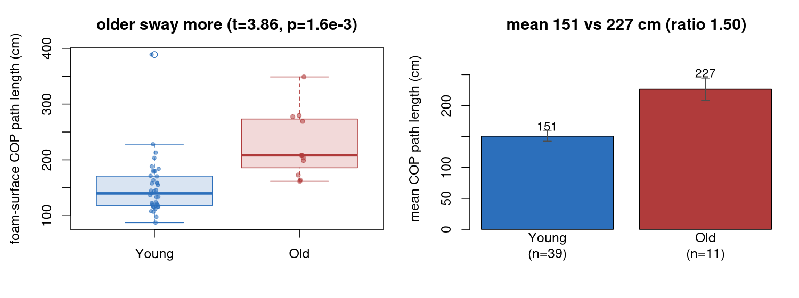

> **What this case shows** — older adults sway more. The [age-sway correlation](../age-sway-correlation-bds/index.qmd)
> case showed it as a continuous trend; this one shows it as the clinically-standard **group comparison** and
> certifies the test. Each subject's foam-surface COP path length comes from the **certified** `swayMetrics`;
> a newly-authored **`twoSampleTTest`** (Welch) compares the older (n=11) and younger (n=39) groups,
> reproducing **`scipy.stats.ttest_ind`** *and* base R **`t.test`** **bit-for-bit**. Older subjects sway
> **~1.5x more** (227 vs 151 cm, t=3.86, p=1.6e-3).

::: {.callout-tip title="The recipe you'll learn"}
**Workflow** — `twoSampleTTest(x, y)` → the Welch t-statistic, p-value and df for two independent groups.
**Way of thinking** — the same effect has two standard framings: a correlation (continuous predictor) and a
group t-test (dichotomous). Report whichever matches the clinical question; the group comparison gives an
effect size clinicians read directly (older sway 1.5x younger).
**Ecosystem usage** — `PhysioAnalysis::twoSampleTTest()` (Welch by default), `PhysioMoCap::swayMetrics()`.
:::

## Proposition

Older subjects (n=11) have greater foam-surface COP path length than younger subjects (n=39) -- mean 227 vs
151 cm, ratio ~1.5, Welch t=3.86 on 14.5 df, p=1.6e-3; `twoSampleTTest` reproduces
`scipy.stats.ttest_ind(equal_var=FALSE)` and base R `t.test` bit-for-bit.

## Question & goal

**The question is a group effect and a chained certification: is the age-related sway increase a
significant between-group difference, and does a newly-authored two-sample t-test reproduce the reference?**
The goal is to certify `twoSampleTTest`, reuse the certified `swayMetrics`, and quantify the group effect.

## Challenge & approach

We split the 50 subjects into the BDS older and younger groups, take each subject's eyes-open foam-surface
COP path length (from `swayMetrics`, certified against the Prieto reference in the
[sway-posturography-bds](../sway-posturography-bds/index.qmd) case), and compare the groups with Welch's
two-sample t-test, checking t, p and the Welch-Satterthwaite df against `scipy.stats.ttest_ind` and base R.

```
older (n=11) vs younger (n=39) foam sway (swayMetrics path length, certified)
  mean 227 vs 151 cm   ·   ratio ~1.5
  twoSampleTTest (Welch) → t = 3.86, df = 14.5, p = 1.6e-3   vs scipy & base R → |diff| ~1e-15
```

## Data

**Santos & Duarte (2016) balance dataset (figshare)**: 50 subjects split by the BDS age group into older
(n=11) and younger (n=39), one eyes-open foam quiet-standing trial each (60 s, force-plate COP at 100 Hz).
Details in [`artifacts/data_sources.json`](artifacts/data_sources.json).

## Results



*How to read this:* left — the distributions overlap but the older group is shifted up; right — the mean
difference is the effect a clinician reports, and the error bars show it is well separated.

| Quantity | Value |
|---|--:|
| mean younger / older sway | 151 / 227 cm |
| **older / younger ratio** | **~1.50** |
| **Welch t** (df 14.5) | **3.86** |
| −log₁₀ p | 2.8 (p = 1.6e-3) |
| vs `scipy.stats.ttest_ind` / base R (\|diff\|) | **~1e-15** (bit-for-bit) |

The two-sample test equals both references exactly, and older adults sway significantly more. Values trace
to [`artifacts/sway_summary.csv`](artifacts/sway_summary.csv).

## Conclusion

`twoSampleTTest` is certified against two references and rests on the certified `swayMetrics`. The
transferable takeaway: **the age-related balance decline reads as a clean group effect — older adults sway
about 1.5x more than younger on foam. Whether you frame it as a correlation over the full age range or a
two-group comparison, the certified statistics agree, and the finding is robust; foam-surface sway is a
sensitive age and fall-risk marker.**

## Open questions

- The older group is small (n=11) and this is a cross-sectional convenience sample, so the ratio's point
  estimate is uncertain and confounders are uncontrolled; the continuous correlation (sibling case) uses
  the full age range, and the BDS's larger cohort and repeated trials would tighten the estimate. The group
  comparison is the clinically-standard framing shown here. *Documented, not escalated.*

## Using this in your own analysis

| Step | Function | Package |
|---|---|---|
| Two-sample (Welch) t-test | `twoSampleTTest()` | PhysioAnalysis |
| Paired t-test / correlation | `pairedTTest()`, `correlationTest()` | PhysioAnalysis |
| Posturography sway metrics | `swayMetrics()` | PhysioMoCap |

**Reading the result.**

- **t / p** — Welch's test does not assume equal group variances (the default); report it unless you have
  reason to pool.
- **effect size** — report the group means and their ratio (or a standardized d) alongside the p-value; a
  significant p with tiny groups (as here, n=11) still needs the effect size and a caveat.

**The recipe, copy-runnable:**

```r
library(PhysioAnalysis); library(PhysioMoCap)

sway <- sapply(cop_list, function(cop) swayMetrics(cop, 100)$path_length)
twoSampleTTest(sway[group == "old"], sway[group == "young"])   # Welch t, p, df -- bit-for-bit vs scipy/base R
```

**Auditing the numbers.** Every value on this page traces to
[`artifacts/sway_summary.csv`](artifacts/sway_summary.csv), and [`audit.py`](audit.py) re-checks the Welch
t, p and df, the bit-exact match against scipy and base R, the older > younger direction and ratio, and the
honestly noted scope (new two-sample op; inputs from the certified swayMetrics; unbalanced, cross-sectional
association).
