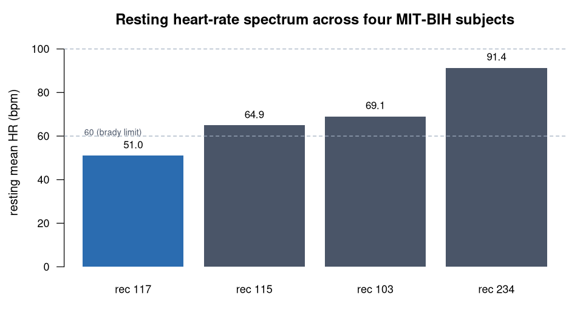

> **What this case shows** — across four MIT-BIH subjects the ecosystem recovers a
> physiologically ordered resting heart-rate spectrum, from **bradycardia (record
> 117, 51.0 bpm)** to the **fast upper-normal range (record 234, 91.4 bpm)**, with
> mean RR the exact reciprocal of mean HR at every record. **What reproduces, and
> what doesn't** — mean HR and mean RR are robust, detector-agnostic quantities and
> reproduce across all four subjects (and the HR = 60000/RR identity holds
> everywhere). The variability metrics (SDNN, RMSSD, pNN50) are sensitive to
> individual R-peak errors, so they are reported *as computed* only — not matched
> to any external reference. **How to read it** — read the Mean HR column top to
> bottom to see the spectrum; the dashed lines mark the 60/100 bpm normal band.

::: {.callout-tip title="The recipe you'll learn"}
**Workflow** — answer *"where does each subject's resting heart rate sit, across a
panel?"* in three moves per record: **detect** the R-peaks → reconstruct the **RR**
intervals → compute **mean HR / RR** (and the rest of the time-domain HRV), then
line the records up into a spectrum.
**Way of thinking** — heart rate is a robust quantity (beats per unit time);
beat-to-beat variability is not, so ground only the robust metrics as findings and
report the rest as computed. Detect on the reliable lead (MLII), and use an
internal consistency check — mean HR should equal 60000/mean RR — to catch errors.
**Ecosystem usage** — chain one function per role, I/O → detection → analysis
(`readWFDB` → `ecgDetectRpeaks` → `ecgRRintervals` → `ecgHRVtime`), run once per
record, letting the shared data model connect the steps. The final section turns
this into a step-by-step you can adapt to your own panel.
:::

## Proposition

Across four MIT-BIH subjects the ecosystem recovers resting mean heart rates
spanning **bradycardia (record 117, 51.0 bpm)** to the **fast upper-normal range
(record 234, 91.4 bpm)**, with mean RR the **exact reciprocal** of mean HR
(HR = 60000/RR to 2 dp) for every record and time-domain HRV differing
**several-fold** between subjects — recovered from four runs on the full 30-min
recordings, all under the same fixed recipe, with mean HR and mean RR verified
against the stored result for the primary record (117).

## Question & goal

**The question comes from the dataset's own purpose.** The MIT-BIH Arrhythmia
Database was created as the first standard test material for evaluating automated
beat/arrhythmia detectors and for basic research into cardiac dynamics (Moody &
Mark, 2001). Any such evaluation rests on one prerequisite: reliably recovering
the beat times — and therefore the heart rate — from the raw ECG. So we ask that
foundational question across subjects: does the ecosystem's detector recover a
physiologically ordered resting **heart-rate spectrum** *reproducibly* from four
full 30-min records, with its two headline quantities internally consistent (mean
HR the exact reciprocal of mean RR) at every point?

## Challenge & approach

Heart rate is a robust, detector-agnostic quantity (beats per unit time); its
beat-to-beat variability is not — successive-difference HRV (RMSSD, pNN50) is
sensitive to individual R-peak detection errors, which is why only **mean HR and
mean RR** are reported as headline claims here (the project's own integrity
lesson). Each record runs the identical three-step recipe, fixed before running,
on the **MLII** lead (channel 1; the V-lead's detection is unreliable):

```
ecgDetectRpeaks(pan_tompkins)  →  ecgRRintervals  →  ecgHRVtime(rhythm_check = FALSE)
```

The recipe is run **four** times — records 117, 115, 103, 234 — and each run is
recorded so its mean HR and mean RR can be checked back against the stored result.
The **primary record** is 117 (the bradycardic end); the other three are carried
in [`artifacts/`](artifacts/), listed in
[`secondary_runs.json`](artifacts/secondary_runs.json). The **spectrum** is then a
comparison of mean-HR / mean-RR cells across records.

## Data

**MIT-BIH Arrhythmia Database** (mitdb), records **117, 115, 103, 234** — full
30-min recordings, MLII lead, 360 Hz — public on PhysioNet
(<https://physionet.org/content/mitdb/>). The exact recordings used are listed in
[`artifacts/data_sources.json`](artifacts/data_sources.json). *Moody GB, Mark
RG. IEEE Eng Med Biol. 2001;20(3):45–50; Goldberger AL, et al. Circulation.
2000;101(23):e215–20.*

## Results



*How to read this:* each row is one subject; read the **Mean HR** column top to
bottom for the spectrum, and check `60000/RR` against Mean HR within each row for
the internal-consistency test.

**The resting heart-rate spectrum** ([`artifacts/ecg_hr_spectrum.csv`](artifacts/ecg_hr_spectrum.csv)):

| Record | Zone | Mean HR (bpm) | Mean RR (ms) | 60000/RR (bpm) | SDNN (ms) | RMSSD (ms) | pNN50 (%) |
|---|---|---|---|---|---|---|---|
| **117** | bradycardia | **51.02** | 1176.02 | 51.02 | 50.5 | 43.6 | 11.9 |
| 115 | normal-low | 64.91 | 924.30 | 64.91 | 88.8 | 76.4 | 46.1 |
| 103 | normal | 69.07 | 868.60 | 69.07 | 98.2 | 132.4 | 10.4 |
| **234** | upper-normal (fast) | **91.37** | 656.70 | 91.37 | 38.7 | 42.4 | 0.9 |

- **Heart rate spans 40.4 bpm**, from bradycardia (117) to the fast upper-normal
  range (234), monotonically across the four subjects.
- **Mean HR is the exact reciprocal of mean RR** — 60000/RR reproduces mean HR to
  2 dp for **every** record (an internal-consistency check that always holds).
- **Time-domain HRV varies several-fold** between subjects (SDNN 38.7–98.2 ms,
  ~2.5×) — reported as computed, not matched to any external reference; the fast,
  regular record (234) sits at the low-variability end.

The primary record (117) reports mean HR **51.02 bpm** and mean RR **1176.02 ms**,
both verified against the stored result
([`bundle/verification_report.json`](bundle/verification_report.json),
[`bundle/terminal_table.csv`](bundle/terminal_table.csv)).

## Conclusion

The ecosystem recovers a physiologically ordered resting heart-rate spectrum
across four public MIT-BIH subjects — bradycardia to fast — as four runs under one
fixed recipe, with the two headline quantities (mean HR, mean RR) verified and
internally consistent (HR = 60000/RR everywhere). The transferable takeaway: build
a cross-subject spectrum from the robust metrics, report the fragile ones honestly
as computed, and let an internal identity check guard every value.

## Open questions

None. Recovering resting heart rate and time-domain HRV from public ECG is a
reproducibility demonstration, not an unresolved question. The
escalation-to-paper path is reserved for genuinely open questions.

## Using this in your own analysis

This case is a worked example of a **cross-subject heart-rate spectrum** — the
pattern for any "where does each subject sit, across a panel?" question built on a
robust, detector-agnostic quantity.

**The general recipe** (three steps per record, then compare):

1. **Detect** the R-peaks with a beat detector — here `pan_tompkins` on the MLII
   lead, the reliable channel for detection.
2. **Reconstruct** the RR intervals and **compute** mean HR / mean RR (plus the
   rest of the time-domain HRV) from them.
3. **Repeat** across the records and line the mean-HR / mean-RR cells up into a
   spectrum, checking `HR = 60000/RR` at every record.

**Which functions, and how they compose.** Each step is one ecosystem function,
picked by *role* — I/O → detection → analysis:

| Step | Function | Package |
|---|---|---|
| load a WFDB recording | `readWFDB()` | PhysioIO |
| detect the R-peaks | `ecgDetectRpeaks()` | PhysioECG |
| reconstruct RR intervals | `ecgRRintervals()` | PhysioECG |
| time-domain HRV (mean HR/RR, …) | `ecgHRVtime()` | PhysioECG |

They chain because each returns a `PhysioExperiment` the next one accepts — the
shared data model is what lets the tools snap together, so you compose an analysis
by naming the steps, not by reshaping data between them.

**Choosing the parameters.**

- **Record** — swap in any WFDB record; wrap the three steps in a function and map
  it over your panel.
- **Lead / channel** — detect on the reliable lead (here MLII = channel 1); the
  V-lead's detection is unreliable on these records, so pick channel 1 from the
  HRV output.
- **Detector (`method`)** — `pan_tompkins` is a robust default on resting ECG;
  detection errors propagate into the variability metrics.
- **Which metrics to trust** — report mean HR and mean RR as findings (robust);
  report SDNN/RMSSD/pNN50 as *computed only* unless you have validated the
  detector on those records, and use the `60000/RR` identity as a per-record
  sanity check.

**Applying it to your own hypothesis.** Swap the four records for your own panel,
keep the same three steps per record, and read the mean-HR column into a spectrum.
The pattern generalises to a single-record HRV analysis validated against a
reference tool ([`ecg-hrv-mitbih`](../ecg-hrv-mitbih/)) and to scoring the
detector itself against a ground truth
([`ecg-qrs-benchmark-mitbih`](../ecg-qrs-benchmark-mitbih/)).

**The recipe, copy-runnable:**

```r
library(PhysioIO); library(PhysioECG)

resting_hr <- function(record) {                 # e.g. "117"
  pe    <- readWFDB(record)                       # PhysioIO: MLII + V lead
  peaks <- ecgDetectRpeaks(pe, method = "pan_tompkins")  # PhysioECG
  rr    <- ecgRRintervals(pe, peaks)
  hrv   <- ecgHRVtime(rr, rhythm_check = FALSE)   # mean_hr, mean_rr, ... per lead
  hrv[hrv$channel == 1, c("mean_hr", "mean_rr")]  # channel 1 = MLII
}
resting_hr("117")   # bradycardia ~51 bpm; repeat over 117/115/103/234
```

**Auditing the numbers.** For readers who want to verify rather than trust: the
complete machine-checkable record — the fixed recipe, the run details, and a
line-by-line check of every number (including the `HR = 60000/RR` identity at each
record) — is in [`bundle/`](bundle/) for the primary record and in
[`artifacts/`](artifacts/) for the other three, and `audit.py` re-derives every
value on this page from those files.
