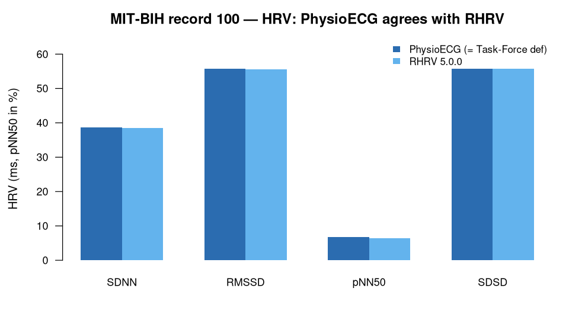

> **What this case shows** — on the gold-standard MIT-BIH ECG (record 100), the
> ecosystem reproduces standard resting-state heart-rate variability: R-peak
> detection matches the cardiologist annotations exactly, and the time-domain HRV
> metrics match a mature reference tool. **What reproduces, and what doesn't** —
> the detection and the HRV reproduce on this record's clean sinus rhythm, agreeing
> with both the Task-Force definitions and the **RHRV** reference. Nothing is
> claimed beyond this clean recording — and pNN50 in particular is
> definition-sensitive: change the `>50` ms threshold or reconstruct RR as floating
> point and the value can swing widely (a synthetic-series artefact, explained
> below). It reproduces here only because, on the real RR series, no interval sits
> on the 50 ms boundary. **How to read it** — compare the PhysioECG column against
> the RHRV column; near-identical values mean the metric reproduced.

::: {.callout-tip title="The recipe you'll learn"}
**Workflow** — answer *"what is this subject's resting HRV, and can I trust the
numbers?"* in four moves: **detect** the R-peaks → reconstruct the **RR** intervals
→ compute **time-domain HRV** → **cross-check** against a reference tool.
**Way of thinking** — HRV is quietly treacherous: the answer depends on the
detector, on how RR is reconstructed, and on the exact definition of each metric.
So pin one recipe, know which metrics are definition-sensitive, keep real and
synthetic data strictly separate, and confirm against a mature implementation
before you trust a value.
**Ecosystem usage** — chain one function per role, I/O → detection → analysis
(`readWFDB` → `ecgDetectRpeaks` → `ecgRRintervals` → `ecgHRVtime`), letting the
shared data model connect them. The final section turns this into a step-by-step
you can adapt to your own recordings.
:::

## Proposition

On the gold-standard MIT-BIH ECG (real record 100), the ecosystem reproduces
standard resting-state HRV: R-peak detection is exact (F1 = 1.000), time-domain
metrics match the Task-Force definitions to `< 1e-6` and agree with the **RHRV**
reference within its known first-interval drop (`< 0.5 %`) — computed end-to-end
from the raw recording under one fixed recipe.

## Question & goal

**The question comes from the dataset's own purpose.** The MIT-BIH Arrhythmia
Database was created as the first standard test material for evaluating automated
beat/arrhythmia detectors against cardiologist annotations, and for basic
research into cardiac dynamics (Moody & Mark, 2001). Its `.atr` beat labels are
the ground truth detectors are scored on. So we ask that founding question: does
the ecosystem's R-peak detector match the cardiologist annotations (F1), and does
the resulting HRV reproduce the standard definitions under one fixed recipe, while
standing up to a mature reference implementation?

## Challenge & approach

HRV looks simple and is quietly treacherous: results depend on the R-peak
detector, on how RR intervals are reconstructed, and on the exact definition of
each metric. Reproducibility therefore demands that the *recipe* be pinned, not
just the code. The recipe is three ecosystem steps, fixed in advance:

```
ecgDetectRpeaks(method = "pan_tompkins")  →  ecgRRintervals  →  ecgHRVtime(rhythm_check = FALSE)
```

The same three steps run every time, and every number on this page is checked
back against the stored result in [`bundle/`](bundle/).

## Data

**MIT-BIH Arrhythmia Database**, record 100 (MLII lead, 360 Hz) with the `.atr`
cardiologist beat annotations — public, on PhysioNet
(<https://physionet.org/content/mitdb/>). *Moody GB, Mark RG. IEEE Eng Med Biol
Mag. 2001;20(3):45–50.* All results below are on **real** data; the only
synthetic artifact ([`artifacts/pnn50_diagnosis.csv`](artifacts/pnn50_diagnosis.csv))
is labelled as such.

## Results



*How to read this:* each row is a standard time-domain HRV metric (ms, or % for
pNN50); PhysioECG — computed to the Task-Force definition — sits beside the RHRV
reference, and near-identical columns mean the metric reproduced.

**R-peak detection is exact** on the primary record
([`artifacts/mitbih_realdata_validation.csv`](artifacts/mitbih_realdata_validation.csv)):

| Record | Precision | Recall | F1 | Ref beats |
|---|---|---|---|---|
| mitdb/100 | 1.00 | 1.00 | **1.000** | 37 |
| mitdb/203 | 0.98 | 0.96 | 0.970 | 51 |

**Time-domain HRV on the real record-100 RR series** (N = 370;
[`artifacts/mitbih_hrv.csv`](artifacts/mitbih_hrv.csv)) — PhysioECG equals the
Task-Force standard definition to `< 1e-6` and agrees with RHRV within its
first-interval drop:

| Metric (ms / %) | PhysioECG (= standard def) | RHRV 5.0.0 |
|---|---|---|
| SDNN | 38.594 | 38.543 |
| RMSSD | 55.716 | 55.640 |
| pNN50 | 6.775 | 6.486 |
| SDSD | 55.791 | 55.716 |

**The resting-HR run** ([`bundle/terminal_table.csv`](bundle/terminal_table.csv),
verified in [`bundle/verification_report.json`](bundle/verification_report.json)):
mean HR = **72.03 bpm**, mean RR = **832.99 ms**. (This run uses a
different window/configuration of record 100 than the HRV table above; both are
real record 100.)

## Conclusion

The ecosystem reproduces resting-state HRV on MIT-BIH to
reference-implementation tolerance, with exact beat detection on record 100, and
the recipe is reproducible in the strong sense: the same fixed steps re-derive the
same numbers every time. A textbook workflow recovered faithfully — the takeaway
is the habit it teaches: detect, reconstruct RR, compute HRV, then cross-check
against a mature tool before you trust the numbers.

## Open questions

None escalated — and *why* is itself the point. pNN50 is definition-sensitive:
on a **deterministic synthetic** series, the `>50` vs `>=50` threshold and
integer-vs-floating-point RR reconstruction span **0 % / 22.2 % / 50.5 %**
([`artifacts/pnn50_diagnosis.csv`](artifacts/pnn50_diagnosis.csv)). It looks
alarming, but keeping real and synthetic strictly separate resolves it: on the
**real** MIT-BIH RR series no interval sits on the 50 ms boundary, and PhysioECG
(6.78 %) and RHRV (6.49 %) agree. It is a documented numeric-reconstruction
artefact, not a defect; the pipeline adopts the Task-Force `>50` / exact-integer
definition. Auditing real against synthetic is what keeps a synthetic anomaly from
being published as a real-data finding.

## Using this in your own analysis

This case is a worked example of a **resting-state HRV measurement** — the pattern
for any "what is this recording's heart-rate variability, and can I trust it?"
question.

**The general recipe** (four steps, the same for any time-domain HRV analysis):

1. **Detect** the R-peaks in the ECG with a beat detector — here `pan_tompkins`,
   the classic detector, robust on clean sinus rhythm.
2. **Reconstruct** the RR intervals (the beat-to-beat spacing) from the detected
   peaks.
3. **Compute** the time-domain HRV metrics (SDNN, RMSSD, pNN50, mean HR/RR) from
   the RR series, to a stated definition.
4. **Cross-check** the metrics against a mature reference implementation on the
   same signal before you report them.

**Which functions, and how they compose.** Each step is one ecosystem function,
picked by *role* — I/O → detection → analysis:

| Step | Function | Package |
|---|---|---|
| load a WFDB recording (with `.atr` beats) | `readWFDB()` | PhysioIO |
| detect the R-peaks | `ecgDetectRpeaks()` | PhysioECG |
| reconstruct RR intervals | `ecgRRintervals()` | PhysioECG |
| time-domain HRV metrics | `ecgHRVtime()` | PhysioECG |

They chain because each returns a `PhysioExperiment` the next one accepts — the
shared data model is what lets the tools snap together, so you compose an analysis
by naming the steps, not by reshaping data between them.

**Choosing the parameters.**

- **Detector (`method`)** — `pan_tompkins` is a robust default on clean resting
  ECG; a noisier recording may need a different detector, and detection errors
  propagate into every successive-difference metric.
- **`rhythm_check = FALSE`** — computes HRV over the full RR series without
  excluding ectopic-beat intervals; turn it on when you want to restrict to normal
  sinus intervals.
- **Which metrics to trust** — mean HR and mean RR are robust and
  detector-agnostic; SDNN/RMSSD are more detection-sensitive, and pNN50 is
  definition-sensitive (the `>50` ms threshold and RR reconstruction matter), so
  fix a definition and cross-check it.
- **Reference tool** — validate against an established implementation (here RHRV)
  on the *same* RR series; match metric definitions first, or a definition
  difference reads as a disagreement.

**Applying it to your own hypothesis.** Swap record 100 for your own recording,
keep the same four steps, and read the metrics you care about. The single-record
workflow generalises directly to a panel of subjects
([`ecg-hr-spectrum-mitbih`](../ecg-hr-spectrum-mitbih/)) and to scoring the
detector itself against a ground truth
([`ecg-qrs-benchmark-mitbih`](../ecg-qrs-benchmark-mitbih/)).

**The recipe, copy-runnable:**

```r
library(PhysioIO); library(PhysioECG)

pe    <- readWFDB("100")                          # PhysioIO: MLII + V5, with .atr beats
peaks <- ecgDetectRpeaks(pe, method = "pan_tompkins")  # PhysioECG
rr    <- ecgRRintervals(pe, peaks)
ecgHRVtime(rr, rhythm_check = FALSE)              # SDNN, RMSSD, pNN50, mean HR/RR
# Detector accuracy: match `peaks` to the cardiologist `.atr` beats -> F1 = 1.000
```

**Auditing the numbers.** For readers who want to verify rather than trust: the
complete machine-checkable record — the fixed recipe, the run details, and a
line-by-line check of every number against the data — is in [`bundle/`](bundle/),
and `audit.py` re-derives every value on this page from the stored results.
