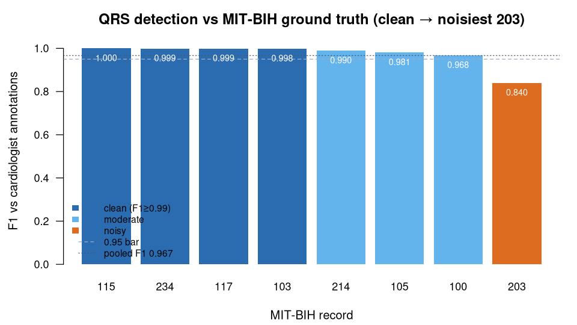

> **What this case shows** — scored against the MIT-BIH cardiologist beat
> annotations under the standard AAMI EC57 tolerance, the ecosystem's `pan_tompkins`
> R-peak detector reaches clinical-grade accuracy (pooled **Se 0.958 · PPV 0.976 ·
> F1 0.967**) across **8 records** from clean sinus to the noisiest. **What
> reproduces, and what doesn't** — on the clean records the detector is essentially
> exact (F1 ≥ 0.99). It does **not** stay that accurate on the noisiest record
> (**203**, F1 **0.84**): heavy noise and artifact break the QRS morphology the
> detector keys on, so detection degrades — reported in full, because reproducing
> that difficulty gradient is exactly what a MIT-BIH benchmark is for. **How to
> read it** — each record's F1 is the detector's agreement with the cardiologists;
> the dashed line is the 0.95 acceptance bar, and the profile from clean to noisy
> is the point.

::: {.callout-tip title="The recipe you'll learn"}
**Workflow** — answer *"how well does my detector match the ground truth, across
easy to hard cases?"* in three moves: **detect** the R-peaks → **score** each
detection against the reference beats under a fixed tolerance → **aggregate** and
report every record, easy and hard alike.
**Way of thinking** — a benchmark is only honest if the protocol is fixed and the
degradation is shown: only true QRS annotations count, matches must fall inside the
tolerance window, each reference beat matches at most one detection, the acceptance
bar is stated *before* scoring, and the worst record is reported rather than
dropped.
**Ecosystem usage** — I/O → detection (`readWFDB` → `ecgDetectRpeaks`), then score
the detector's output against the cardiologist `.atr` beats with a greedy nearest
match. The final section turns this into a step-by-step you can adapt to your own
detector and records.
:::

## Proposition

Scored against the MIT-BIH cardiologist beat annotations under the AAMI EC57
tolerance across **8 records** (clean sinus to the noisiest record, **203**), the
ecosystem's `pan_tompkins` R-peak detector reaches pooled **Se 0.958**, **PPV
0.976**, **F1 0.967** — clinical-grade — with per-record F1 from **0.9997** on
clean records down to **0.8403** on record 203, reproducing the exact performance
profile MIT-BIH was built to measure.

## Question & goal

**The question is the one this database exists to answer.** The MIT-BIH
Arrhythmia Database was created as the first standard test material for
**evaluating automated beat detectors** against cardiologist annotations (Moody &
Mark, 2001) — its `.atr` files are the ground truth detectors are scored on. So we
ask that founding question directly: how well does the ecosystem's detector match
the cardiologists, across records that span easy to hard, under the standard
scoring protocol?

## Challenge & approach

Beat-detector scoring has a fixed, published protocol, and getting it wrong
inflates the score: only true QRS annotations count (rhythm/noise marks excluded),
matches must fall within the **AAMI EC57** window (150 ms), and each reference
beat may match at most one detection. The recipe is a single ecosystem tool —

```
ecgDetectRpeaks(method = "pan_tompkins")     # on the MLII lead
```

— and its output is scored by greedy nearest matching against the cardiologist
`.atr` beats: Sensitivity `Se = TP/(TP+FN)`, `PPV = TP/(TP+FP)`, `F1 =
2TP/(2TP+FP+FN)`. This is a **validated** case: a match against a real ground
truth. The acceptance bar is stated up front — pooled Se, PPV, F1 ≥ 0.95 — and
**every** record is reported, including where the detector degrades.

## Data

**MIT-BIH Arrhythmia Database** (mitdb), records **100, 103, 105, 115, 117, 203,
214, 234** — MLII lead, 360 Hz, full 30-min — with the cardiologist `.atr` beat
annotations, public on PhysioNet (<https://physionet.org/content/mitdb/>). The
exact recordings used are listed in
[`artifacts/data_sources.json`](artifacts/data_sources.json). Ground-truth beats
were extracted from the `.atr` with WFDB 4.3.1 (AAMI beat symbols). *Moody GB,
Mark RG. IEEE Eng Med Biol Mag. 2001;20(3):45–50; Goldberger AL, et al.
Circulation. 2000;101(23):e215–20.*

## Results



*How to read this:* each bar is one record's F1 — the detector's agreement with
the cardiologist beats; the dashed line is the 0.95 acceptance bar and the dotted
line the pooled F1, so the clean-to-noisy gradient is what to look at.

**Detector vs cardiologist annotations** ([`artifacts/qrs_benchmark.csv`](artifacts/qrs_benchmark.csv)):

| Record | Difficulty | Ref beats | TP | FP | FN | Se | PPV | F1 |
|---|---|---|---|---|---|---|---|---|
| 115 | clean | 1953 | 1953 | 1 | 0 | 1.0000 | 0.9995 | **0.9997** |
| 234 | clean | 2753 | 2749 | 0 | 4 | 0.9985 | 1.0000 | 0.9993 |
| 117 | clean | 1535 | 1534 | 2 | 1 | 0.9993 | 0.9987 | 0.9990 |
| 103 | clean | 2084 | 2078 | 1 | 6 | 0.9971 | 0.9995 | 0.9983 |
| 214 | moderate | 2262 | 2235 | 20 | 27 | 0.9881 | 0.9911 | 0.9896 |
| 105 | moderate | 2572 | 2539 | 64 | 33 | 0.9872 | 0.9754 | 0.9813 |
| 100 | moderate | 2273 | 2132 | 1 | 141 | 0.9380 | 0.9995 | 0.9678 |
| **203** | **noisy** | 2980 | 2415 | 353 | 565 | 0.8104 | 0.8725 | **0.8403** |
| **GROSS** | pooled | 18412 | 17635 | 442 | 777 | **0.9578** | **0.9755** | **0.9666** |

- On the **clean** records the detector is essentially exact (F1 ≥ 0.998).
- On the **noisiest** record (**203**) it degrades to F1 **0.84** — this is
  reported, not hidden: heavy noise and artifact break the QRS morphology the
  detector keys on, and reproducing that difficulty gradient is exactly what a
  MIT-BIH benchmark is for.
- **Pooled Se 0.958, PPV 0.976, F1 0.967** all clear the stated 0.95
  clinical-grade bar.

## Conclusion

The ecosystem's R-peak detector meets the cardiologist ground truth at
clinical-grade accuracy across the MIT-BIH difficulty range — the exact task the
database was built to score — with every record, including the noisiest,
reported in full. The transferable takeaway: fix the scoring protocol, state the
acceptance bar before you look, and report the hard record — a benchmark you can
trust is one that shows where the method breaks.

## Open questions

None. Benchmarking a beat detector against the cardiologist ground truth is
exactly what MIT-BIH was built for. The escalation-to-paper path is reserved for
genuinely unresolved questions.

## Using this in your own analysis

This case is a worked example of a **detector benchmark** — the pattern for any
"how well does my method match a ground truth, across easy to hard cases?"
question.

**The general recipe** (three steps, the same for any detector benchmark):

1. **Detect** the events with your detector — here R-peaks with `pan_tompkins` on
   the MLII lead.
2. **Score** the detections against the reference beats: match each detection to
   the nearest unused reference beat within a fixed tolerance, then count TP / FP /
   FN and form Se, PPV, F1.
3. **Aggregate** across records (pool the counts for the gross totals) and report
   *every* record against a pre-stated acceptance bar, including the worst one.

**Which functions, and how they compose.** Detection is one ecosystem function;
scoring is a matching step you run on its output:

| Step | Function | Package |
|---|---|---|
| load a WFDB recording (with `.atr` beats) | `readWFDB()` | PhysioIO |
| detect the R-peaks | `ecgDetectRpeaks()` | PhysioECG |
| score detections vs ground truth | greedy nearest match (AAMI EC57) | analysis harness |

Detection returns a `PhysioExperiment` (and the detected sample indices), so the
shared data model carries you from the raw recording to the detected beats; the
scoring step then compares those beats to the reference samples.

**Choosing the parameters.**

- **Detector (`method`)** — `pan_tompkins` is a robust default; it is exact on
  clean sinus and degrades under heavy noise, which is the profile you want a
  benchmark to reveal.
- **Lead / channel** — score on the reliable lead (here MLII = channel 1).
- **Tolerance** — the AAMI EC57 window, `round(0.15 * fs)` = 150 ms; a matched
  detection must fall within it, and each reference beat matches at most one
  detection.
- **Acceptance bar** — decide it *before* scoring (here pooled Se, PPV, F1 ≥ 0.95)
  and report the full per-record range, hardest record included, so the bar can't
  be reverse-engineered from the result.

**Applying it to your own hypothesis.** Swap in your own records and their ground
truth, keep the detect → score → aggregate steps, and set your own acceptance bar.
The same detector feeds a resting-state HRV analysis
([`ecg-hrv-mitbih`](../ecg-hrv-mitbih/)) and a cross-subject heart-rate spectrum
([`ecg-hr-spectrum-mitbih`](../ecg-hr-spectrum-mitbih/)).

**The recipe, copy-runnable:**

```r
library(PhysioIO); library(PhysioECG)

score_record <- function(record, ref_beats) {   # ref_beats = cardiologist .atr samples
  pe  <- readWFDB(record); fs <- samplingRate(pe)          # PhysioIO
  mlii <- PhysioExperiment(assays = list(raw = SummarizedExperiment::assay(pe, "raw")[, 1, drop = FALSE]),
                           samplingRate = fs)
  det <- ecgDetectRpeaks(mlii, method = "pan_tompkins")$sample   # PhysioECG
  tol <- round(0.15 * fs)                                   # AAMI EC57: 150 ms
  # greedy nearest match det <-> ref_beats within tol -> TP/FP/FN -> Se, PPV, F1
}
score_record("117")   # clean, F1 0.999; repeat over the 8-record panel incl. 203
```

**Auditing the numbers.** For readers who want to verify rather than trust: the
ground-truth beats ([`artifacts/ref_beats.json`](artifacts/ref_beats.json),
extracted from each `.atr` with WFDB) and the scored table
([`artifacts/qrs_benchmark.csv`](artifacts/qrs_benchmark.csv)) are in
[`artifacts/`](artifacts/), and `audit.py` re-derives every Se/PPV/F1 (and the
pooled totals) from those files.
