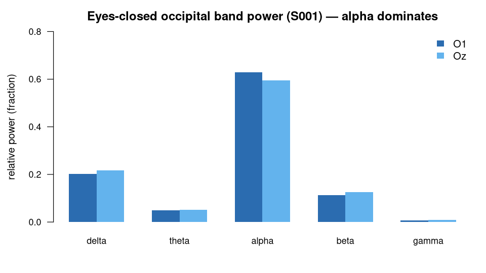

> **What this case shows** — with the eyes closed, relative **alpha** power is the
> single dominant rhythm at the occipital electrode O1, and the same holds at a
> second occipital electrode, Oz — the classic Berger alpha rhythm, recovered
> end-to-end from a public recording. **What reproduces, and what doesn't** — the
> *pattern* (alpha dominates, and it replicates at Oz) reproduces from the public
> recording and is stable on re-run. The exact alpha value is not a universal
> constant: it moves with the analysis choices (filter band, relative-vs-absolute
> power, montage), so it reproduces *under this fixed recipe*, not across arbitrary
> pipelines — and this is one subject, so it is not yet a population claim (the
> cohort question is a separate case). **How to read it** — each number is a band's
> share of the total power at that electrode, so the five bands sum to ~1; the
> largest share is the dominant rhythm. Alpha (8–13 Hz) is the tallest at both
> electrodes.

::: {.callout-tip title="The recipe you'll learn"}
**Workflow** — answer *"which rhythm dominates in one recording — and does it
replicate?"*: **load** the recording and pick the channel where the rhythm lives →
**band-limit** with a Butterworth filter → **quantify** each band's share with
`bandPower()` → **replicate** by re-running the identical recipe at a second
electrode.
**Way of thinking** — place electrodes over the rhythm's generator (occipital for
alpha); read spectral *shape* (relative power) when you care which rhythm
dominates; and treat a second electrode as a built-in replication, not decoration
— a finding that survives an independent channel is far stronger than a single
number.
**Ecosystem usage** — chain one function per role, I/O → preprocessing → analysis
(`readEDF` → `butterworthFilter` → `bandPower`), letting the shared data model
connect them. The final section turns this into a step-by-step you can adapt to
your own recordings.
:::

## Proposition

On eyes-closed baseline EEG, relative **alpha** power dominates every other band
at the occipital electrode **O1 (0.628)** and replicates at **Oz (0.596)** — the
classic Berger alpha rhythm — reproduced end-to-end by the ecosystem from the
public recording.

## Question & goal

**The question comes from the dataset's own design.** eegmmidb was built with
BCI2000 to decode motor movement and imagery from EEG (Schalk et al., 2004); its
protocol opens with an **eyes-closed baseline run (R02)** recorded to establish
each subject's resting state — the reference against which motor-task activity is
measured. That resting baseline is defined by the posterior alpha rhythm. So we
ask the baseline's own question: does the ecosystem recover the eyes-closed
occipital **alpha dominance** that characterizes the resting state — end-to-end
from the raw EDF to relative band powers — and does it **replicate** at an
independent occipital electrode?

## Challenge & approach

Relative band power is definition- and preprocessing-sensitive: it depends on the
filter band, the windowing, and the exact frequency edges of each rhythm. A claim
that *alpha dominates* is only trustworthy if the whole path from raw EDF to band
shares is fixed and applied the same way everywhere. The recipe is three steps:

```
readEDF(channels = "O1")  →  butterworthFilter(low = 1, high = 45)  →  bandPower(relative = TRUE)
```

It is run at O1 to establish the dominance, then re-run **unchanged** at Oz — a
second occipital electrode — as a built-in replication. This is the same
eyes-closed O1 spectrum used as one arm of the sibling contrast case
[`eeg-berger-eegmmidb`](../eeg-berger-eegmmidb/), matching to the last digit — a
free cross-check that the pipeline is stable.

## Data

**EEG Motor Movement/Imagery Database** (eegmmidb), record **S001R02** — the
eyes-closed baseline run, 64 channels, 160 Hz — public on PhysioNet
(<https://physionet.org/content/eegmmidb/>). The exact recording used is listed in
[`artifacts/data_sources.json`](artifacts/data_sources.json). *Schalk G, et al.
IEEE Trans Biomed Eng. 2004;51(6):1034–43.*

## Results



*How to read this:* each number is a band's share of the total power at that
electrode, so the five bands sum to ~1. Alpha is 8–13 Hz; the largest share is the
dominant rhythm.

**Relative band power at O1** ([`bundle/terminal_table.csv`](bundle/terminal_table.csv)):

| Band | Relative power (O1) |
|---|---|
| delta | 0.203 |
| theta | 0.050 |
| **alpha** | **0.628** |
| beta | 0.113 |
| gamma | 0.006 |

Alpha exceeds every other band — the eyes-closed occipital alpha.

**Replication at Oz** ([`artifacts/oz_replication_terminal.csv`](artifacts/oz_replication_terminal.csv)):
alpha = **0.596**, again dominant (delta 0.218, theta 0.051, beta 0.126,
gamma 0.010). The finding survives an independent occipital electrode
([`bundle/verification_report.json`](bundle/verification_report.json)).

## Conclusion

The ecosystem reproduces the canonical eyes-closed occipital alpha rhythm on
public EEG and replicates it at a second occipital electrode, computed end-to-end
from the raw recording. The transferable takeaway is the *pattern* — alpha
dominates, and it holds at an independent channel — not any single band value,
which shifts with the recipe.

## Open questions

None. This is an established textbook finding (Berger, 1929), used here to
demonstrate reproducible spectral analysis end-to-end on public EEG. The
escalation-to-paper path is reserved for cases that surface a genuinely
unresolved question.

## Using this in your own analysis

This case is a worked example of **single-condition band power with a built-in
replication** — the pattern for any "which rhythm dominates here, and does it hold
at a second sensor?" question.

**The general recipe:**

1. **Load** the recording and pick the channel(s) where the rhythm lives — here
   occipital O1, because alpha is generated posteriorly.
2. **Filter** to the analysis band with a Butterworth filter — here 1–45 Hz, wide
   enough to keep every rhythm while removing slow drift and line noise.
3. **Quantify** with `bandPower(relative = TRUE)` and read which band holds the
   largest share — here alpha.
4. **Replicate** by re-running the identical recipe at a second, independent
   electrode (Oz) and checking the finding still holds.

**Which functions, and how they compose.** Each step is one ecosystem function,
picked by *role* — I/O → preprocessing → analysis:

| Step | Function | Package |
|---|---|---|
| load an EDF recording | `readEDF()` | PhysioIO |
| band-limit the signal | `butterworthFilter()` | PhysioPreprocess |
| spectral power per band | `bandPower()` | PhysioAnalysis |

They chain because each returns a `PhysioExperiment` the next one accepts — the
shared data model is what lets the tools snap together, so you compose an analysis
by naming the steps, not by reshaping data between them.

**Choosing the parameters.**

- **Channel** — put electrodes over the generator of the rhythm (occipital for
  alpha; move to C3/C4 for the sensorimotor mu, to frontal sites for slow waves).
- **Filter band (`low`, `high`)** — wide enough to contain the rhythm (alpha
  8–13 Hz sits comfortably inside 1–45 Hz); the 45 Hz high cut keeps line noise
  (50/60 Hz) out. Narrow it only if you must isolate one rhythm.
- **`relative = TRUE`** — reports each band as a fraction of total power, so the
  comparison is about spectral *shape* (which rhythm dominates), robust to the
  absolute-scale drift that impedance and montage introduce. Use `FALSE` when the
  absolute change matters (e.g. event-related desynchronization).
- **The second electrode** — pick an independent channel over the same generator;
  a finding that survives it is far stronger than one number from one sensor.

**Applying it to your own hypothesis.** Swap the recording for yours, the channel
for your rhythm's location, and the band you read from `bandPower()`. The
single-condition dominance check generalises directly to a two-condition contrast
([`eeg-berger-eegmmidb`](../eeg-berger-eegmmidb/)) and to a whole cohort
([`eeg-alpha-reactivity-eegmmidb`](../eeg-alpha-reactivity-eegmmidb/)).

**The recipe, copy-runnable:**

```r
library(PhysioIO); library(PhysioPreprocess); library(PhysioAnalysis)

pe <- readEDF("S001R02.edf", channels = "O1..")   # PhysioIO: eyes-closed baseline
f  <- butterworthFilter(pe, low = 1, high = 45)    # PhysioPreprocess
bandPower(f, relative = TRUE)   # PhysioAnalysis: delta..gamma, alpha dominant
# replicate at a second occipital electrode:
bandPower(butterworthFilter(readEDF("S001R02.edf", channels = "Oz.."),
                            low = 1, high = 45), relative = TRUE)
```

**Auditing the numbers.** For readers who want to verify rather than trust: the
complete machine-checkable record — the exact recipe, the run details, and a
line-by-line check of every number against the data — is in [`bundle/`](bundle/),
and `audit.py` re-derives every value on this page from the stored results.
