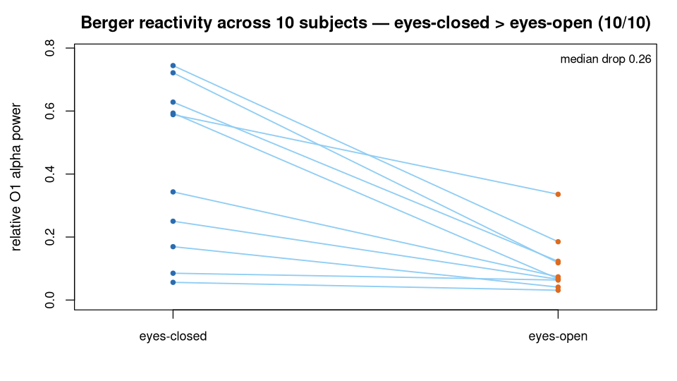

> **What this case shows** — the eyes-closed → eyes-open drop in occipital alpha
> — Berger's reactivity — holds in **10 of 10** eegmmidb subjects, so the resting
> baseline behaves consistently across the cohort. **What reproduces, and what
> doesn't** — the within-subject *reactivity* (alpha higher eyes-closed than
> eyes-open) reproduces in all ten subjects and is stable on re-run. Absolute
> alpha *dominance* — alpha being the single largest band — does **not** hold
> everywhere: it is true in only 5/10 subjects, because at a single electrode with
> no artifact rejection several O1 channels are swamped by drift (delta) or muscle
> (gamma). We report that honestly rather than hide it; the reactivity survives
> because it is a within-subject comparison. The exact per-subject values also move
> with the recipe (filter band, relative power, montage). **How to read it** — for
> each subject compare alpha eyes-closed vs eyes-open; a lower value with the eyes
> open is the reactivity. "Alpha-dominant?" flags whether alpha was also the single
> largest band eyes-closed.

::: {.callout-tip title="The recipe you'll learn"}
**Workflow** — answer *"does a within-subject effect hold across a whole
cohort?"*: **run the identical contrast for every subject** (load each condition →
band-limit → `bandPower()` → compare), then **count honestly** what fraction shows
the effect — every subject, not just the clean ones.
**Way of thinking** — resist two temptations: cherry-picking the subjects where
the effect is cleanest, and over-claiming the fragile part (absolute dominance)
when only the robust part (within-subject reactivity) survives a noisy single
electrode. A within-subject contrast is robust to per-subject artifacts precisely
because each subject is their own baseline.
**Ecosystem usage** — the same three functions per subject, I/O → preprocessing →
analysis (`readEDF` → `butterworthFilter` → `bandPower`), connected by the shared
data model; the count across subjects is the only extra step. The final section
turns this into a step-by-step you can adapt to your own cohort.
:::

## Proposition

Relative occipital (O1) alpha power is higher with the eyes closed than open in
**10 of 10** independent eegmmidb subjects (mean drop **0.308**) — Berger's alpha
reactivity replicated at group level — reproduced end-to-end by the ecosystem
across all twenty baseline runs. **Absolute** alpha dominance at O1 is *not*
claimed (it holds in only 5/10 subjects — several O1 channels are
artifact-dominated); the reported, robust quantity is the eyes-closed > eyes-open
**reactivity**.

## Question & goal

**The question comes from the dataset's own design.** eegmmidb was built with
BCI2000 to decode voluntary motor movement and imagery from EEG (Schalk et al.,
2004); its protocol opens with two baseline runs — **eyes-open (R01)** and
**eyes-closed (R02)** — recorded precisely to establish each subject's resting
state, the reference against which motor-task activity is later measured. A
baseline is only trustworthy if it behaves consistently across the cohort. So we
ask the baseline's own question: does the eyes-closed → eyes-open **alpha
reactivity** that defines the resting state hold across *all ten* subjects,
reproducibly and honestly counted — not cherry-picked?

## Challenge & approach

Two temptations must be resisted: selecting only the subjects where the effect is
cleanest, and over-claiming absolute alpha *dominance* — which, at a single
electrode with no artifact rejection, holds in only about half the subjects. So
the case runs the **identical** recipe for **every** subject and **both**
baselines, and reports whatever fraction is reactive:

```
readEDF(channels = "O1..")  →  butterworthFilter(low = 1, high = 45)  →  bandPower(relative = TRUE)
```

Twenty runs in all — {S001…S010} × {eyes-closed R02, eyes-open R01}. The lead
example is S001 eyes-closed O1, which reproduces the anchor spectrum (alpha
0.628). Reactivity is then simply a per-subject comparison of the eyes-closed vs
eyes-open alpha share.

## Data

**EEG Motor Movement/Imagery Database** (eegmmidb), subjects **S001–S010**, both
baseline runs each — **R02** (eyes-closed) and **R01** (eyes-open), 64 channels,
160 Hz — public on PhysioNet (<https://physionet.org/content/eegmmidb/>). The
exact recordings used are listed in
[`artifacts/data_sources.json`](artifacts/data_sources.json). *Schalk G, et al.
IEEE Trans Biomed Eng. 2004;51(6):1034–43; Goldberger AL, et al. Circulation.
2000;101(23):e215–20.* Licensed ODC-BY 1.0.

## Results



*How to read this:* each row is one subject; compare the eyes-closed and eyes-open
alpha shares — a lower value with the eyes open is the reactivity. "Reactive?"
marks a drop; "Alpha-dominant (closed)?" marks whether alpha was also the single
largest band eyes-closed.

**Occipital-O1 relative alpha, eyes-closed vs eyes-open, per subject**
([`artifacts/reactivity_panel.csv`](artifacts/reactivity_panel.csv)):

| Subject | Alpha (eyes-closed) | Alpha (eyes-open) | Drop | Reactive? | Alpha-dominant (closed)? |
|---|---|---|---|---|---|
| S001 | 0.628 | 0.123 | 0.505 | ✓ | ✓ |
| S002 | 0.744 | 0.185 | 0.559 | ✓ | ✓ |
| S003 | 0.721 | 0.118 | 0.603 | ✓ | ✓ |
| S004 | 0.593 | 0.067 | 0.526 | ✓ | ✓ |
| S005 | 0.056 | 0.031 | 0.025 | ✓ | ✗ (gamma) |
| S006 | 0.085 | 0.063 | 0.022 | ✓ | ✗ (delta) |
| S007 | 0.589 | 0.336 | 0.253 | ✓ | ✓ |
| S008 | 0.343 | 0.074 | 0.270 | ✓ | ✗ (delta) |
| S009 | 0.169 | 0.041 | 0.128 | ✓ | ✗ (gamma) |
| S010 | 0.250 | 0.066 | 0.184 | ✓ | ✗ (delta) |

- **Reactivity is universal in this panel: 10/10 subjects** show higher relative
  O1 alpha eyes-closed than eyes-open (mean drop 0.308).
- **Absolute dominance is not** — alpha is the single dominant O1 band eyes-closed
  in only **5/10** subjects; in the others O1 is dominated by delta (drift) or
  gamma (EMG). These are reported, not hidden — the reactivity survives the
  artifact because it is a within-subject contrast.

The lead record (S001 eyes-closed O1) reports the five band powers — alpha
**0.628**, dominant — each traced to its source table
([`bundle/terminal_table.csv`](bundle/terminal_table.csv),
[`bundle/verification_report.json`](bundle/verification_report.json)).

## Conclusion

Berger's alpha reactivity — occipital alpha higher with the eyes closed —
reproduces across all ten public eegmmidb subjects, computed end-to-end from the
raw recordings. The more fragile claim of absolute alpha *dominance* is honestly
limited to the 5/10 subjects whose O1 is not artifact-dominated — a reminder that
the transferable takeaway is the within-subject contrast, not any single band
value.

## Open questions

None. Berger's alpha reactivity (Berger, 1929) is an established finding, used
here to demonstrate a reproducible group-level contrast on public EEG. The
escalation-to-paper path is reserved for genuinely unresolved questions.

## Using this in your own analysis

This case is a worked example of **taking one within-subject contrast to a whole
cohort** — the pattern for any "does this effect hold across everyone, honestly
counted?" question.

**The general recipe:**

1. **Fix one within-subject contrast** — two conditions per subject, the same
   channel, the same band.
2. **Run the identical three-step recipe** (load → filter → `bandPower()`) for
   every subject and both conditions.
3. **Compare** the band of interest within each subject.
4. **Count honestly** across the cohort — report the fraction that shows the
   effect, including the subjects where it is weak or where a different band
   dominates.

**Which functions, and how they compose.** Each step is one ecosystem function,
picked by *role* — I/O → preprocessing → analysis:

| Step | Function | Package |
|---|---|---|
| load an EDF recording | `readEDF()` | PhysioIO |
| band-limit the signal | `butterworthFilter()` | PhysioPreprocess |
| spectral power per band | `bandPower()` | PhysioAnalysis |

They chain because each returns a `PhysioExperiment` the next one accepts — the
shared data model lets the tools snap together, so scaling from one subject to ten
is a loop over the same three named steps, not a rewrite.

**Choosing the parameters.**

- **Channel** — put the electrode over the rhythm's generator (occipital O1 for
  alpha). With a single electrode and no artifact rejection, expect some subjects'
  channels to be dominated by drift or muscle; that is why the within-subject
  contrast, not the absolute value, is the robust readout.
- **Filter band (`low`, `high`)** — wide enough to contain the rhythm (alpha
  8–13 Hz inside 1–45 Hz); the 45 Hz high cut keeps line noise out.
- **`relative = TRUE`** — reports each band as a fraction of total power; the
  reactivity is a change in that share between conditions.
- **Which quantity to claim** — prefer the within-subject contrast (reactivity),
  robust to per-subject artifacts, over the absolute dominance, which is not.
  Report both, claim the robust one.
- **The count** — decide the subjects in advance and report all of them; the
  honest denominator (10/10 reactive, 5/10 dominant) *is* the finding.

**Applying it to your own hypothesis.** Swap the two conditions and the cohort for
yours, keep one channel and one band, and count. The pattern scales up from a
single subject's contrast ([`eeg-berger-eegmmidb`](../eeg-berger-eegmmidb/)) to any
cohort, and transfers to a movement-vs-rest contrast at C3/C4
([`eeg-motor-erd-eegmmidb`](../eeg-motor-erd-eegmmidb/)).

**The recipe, copy-runnable:**

```r
library(PhysioIO); library(PhysioPreprocess); library(PhysioAnalysis)

# relative occipital-O1 alpha from one eegmmidb baseline EDF
relative_alpha_O1 <- function(edf) {
  pe <- readEDF(edf, channels = "O1..")           # PhysioIO
  f  <- butterworthFilter(pe, low = 1, high = 45)  # PhysioPreprocess
  bandPower(f, relative = TRUE)$alpha              # PhysioAnalysis
}

# Berger reactivity for a subject: eyes-closed (R02) vs eyes-open (R01)
alpha_closed <- relative_alpha_O1("S001R02.edf")
alpha_open   <- relative_alpha_O1("S001R01.edf")
alpha_closed > alpha_open        # TRUE = reactive (repeat over S001..S010 -> 10/10)
```

**Auditing the numbers.** For readers who want to verify rather than trust: every
number on this page — the lead spectrum, the per-subject reactivity, and the 10/10
count — is re-derived from the stored results by `audit.py`, with the full
machine-checkable record in [`bundle/`](bundle/) and [`artifacts/`](artifacts/).
