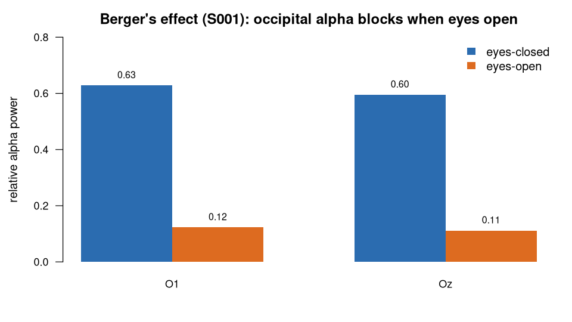

> **What this case shows** — the ecosystem reproduces Berger's classic finding:
> with the eyes closed, occipital **alpha** dominates; open the eyes and it
> collapses. **What reproduces, and what doesn't** — the *contrast* reproduces
> exactly from the public recording and is stable on re-run. The absolute
> band-power numbers are not universal constants: they shift with the analysis
> choices (filter band, relative-vs-absolute power, montage), so they reproduce
> *under this fixed recipe*, not across arbitrary pipelines — and this is one
> subject, so it is not yet a population claim (the cohort question is a separate
> case). **How to read it** — compare the alpha value between eyes-closed and
> eyes-open; the large drop is the effect.

::: {.callout-tip title="The recipe you'll learn"}
**Workflow** — answer *"does a brain rhythm change between two conditions?"* in
three moves: **load** each condition → **band-limit** with the same filter →
**quantify** with `bandPower()` → **compare**.
**Way of thinking** — process both conditions with the *identical* recipe (or a
method difference masquerades as a brain difference); place electrodes over the
rhythm's generator; ask whether you care about spectral *shape* or absolute
*magnitude*.
**Ecosystem usage** — chain one function per role, I/O → preprocessing →
analysis (`readEDF` → `butterworthFilter` → `bandPower`), letting the shared
data model connect them. The final section turns this into a step-by-step you
can adapt to your own recordings.
:::

## Proposition

On the same subject and montage, occipital relative **alpha** power is dominant
with the eyes **closed** (O1 **0.628**, Oz **0.596**) and drops sharply when the
eyes **open** (O1 **0.123**, Oz **0.112**) — **Berger's alpha-blocking effect** —
reproduced end-to-end by the ecosystem from the public recordings.

## Question & goal

**The question comes from the dataset's own design.** eegmmidb was built with
BCI2000 to decode motor movement and imagery from EEG (Schalk et al., 2004); its
protocol opens with two baseline runs — **eyes-open (R01)** and **eyes-closed
(R02)** — recorded to establish the subject's resting state, the reference against
which motor-task activity is measured. What defines that resting baseline is the
posterior alpha rhythm and its reactivity to eye closure. So we ask the baseline's
own question: does the ecosystem recover the classic **alpha blocking**
(eyes-closed ≫ eyes-open), and does it hold as a clean, whole comparison rather
than a one-off number?

## Challenge & approach

A contrast is only as trustworthy as its two arms. Relative band power depends on
the filter band, the windowing, and the exact edges of each rhythm, so the two
conditions must be processed by the **identical** recipe — otherwise a difference
in *method* masquerades as a difference in *brain state*. The recipe is three
steps, the same for both conditions and both electrodes:

```
readEDF(channels = "<Oi>")  →  butterworthFilter(low = 1, high = 45)  →  bandPower(relative = TRUE)
```

It is run four times — {eyes-closed R02, eyes-open R01} × {O1, Oz} — and the four
resulting spectra are compared. The eyes-closed O1 spectrum also matches the
sibling case [`eeg-alpha-eegmmidb`](../eeg-alpha-eegmmidb/) to the last digit, a
free cross-check that the pipeline is stable.

## Data

**EEG Motor Movement/Imagery Database** (eegmmidb), subject **S001**, both
baseline runs — **R02** (eyes-closed) and **R01** (eyes-open), 64 channels,
160 Hz — public on PhysioNet (<https://physionet.org/content/eegmmidb/>). The
exact recordings used (with checksums) are listed in
[`artifacts/data_sources.json`](artifacts/data_sources.json). *Schalk G, et al.
IEEE Trans Biomed Eng. 2004;51(6):1034–43; Goldberger AL, et al. Circulation.
2000;101(23):e215–20.* Licensed ODC-BY 1.0.

## Results



*How to read this:* each number is a band's share of the total power at that
electrode, so the five bands in a column sum to ~1. Alpha is 8–13 Hz.

**Eyes-closed, O1** ([`bundle/terminal_table.csv`](bundle/terminal_table.csv)) —
alpha dominates:

| Band | Relative power (O1) |
|---|---|
| delta | 0.203 |
| theta | 0.050 |
| **alpha** | **0.628** |
| beta | 0.113 |
| gamma | 0.006 |

**Eyes-open, O1** ([`artifacts/eyesopen_O1_terminal.csv`](artifacts/eyesopen_O1_terminal.csv))
— alpha collapses and **delta** takes over:

| Band | Relative power (O1) |
|---|---|
| **delta** | **0.603** |
| theta | 0.102 |
| alpha | 0.123 |
| beta | 0.158 |
| gamma | 0.014 |

**The Berger contrast** ([`artifacts/berger_contrast.csv`](artifacts/berger_contrast.csv)):

| Electrode | Alpha (eyes-closed) | Alpha (eyes-open) | Alpha drop | Alpha dominant? |
|---|---|---|---|---|
| O1 | 0.628 | 0.123 | **0.505** | closed ✓ → open ✗ |
| Oz | 0.596 | 0.112 | **0.484** | closed ✓ → open ✗ |

At **both** occipital electrodes, relative alpha falls by roughly half of total
power when the eyes open, and alpha ceases to be the dominant band — the hallmark
of Berger's alpha blocking.

## Conclusion

The ecosystem reproduces Berger's alpha-blocking effect on public EEG: eyes-closed
occipital alpha dominance collapses when the eyes open, at two occipital
electrodes, computed end-to-end from the raw recordings. A textbook effect
recovered faithfully — the kind of check that tells you the tool can be trusted on
questions whose answer you *don't* already know.

## Open questions

None. Berger's alpha blocking (Berger, 1929) is an established finding, used here
to demonstrate a reproducible spectral **contrast** on public data. The
escalation-to-paper path is reserved for genuinely unresolved questions.

## Using this in your own analysis

This case is a worked example of a **spectral contrast** — the pattern for any
"does rhythm *X* change between condition *A* and *B*?" question.

**The general recipe** (three steps, the same for any band-power contrast):

1. **Load** one recording per condition and pick the channel(s) where the rhythm
   lives — here occipital O1/Oz, because alpha is generated posteriorly.
2. **Filter** to the analysis band with a Butterworth filter — here 1–45 Hz, wide
   enough to keep every rhythm while removing slow drift and line noise.
3. **Quantify** with `bandPower(relative = TRUE)`, read the band of interest
   (alpha), and compare the conditions.

**Which functions, and how they compose.** Each step is one ecosystem function,
picked by *role* — I/O → preprocessing → analysis:

| Step | Function | Package |
|---|---|---|
| load an EDF recording | `readEDF()` | PhysioIO |
| band-limit the signal | `butterworthFilter()` | PhysioPreprocess |
| spectral power per band | `bandPower()` | PhysioAnalysis |

They chain because each returns a `PhysioExperiment` the next one accepts — the
shared data model is what lets the tools snap together, so you compose an analysis
by naming the steps, not by reshaping data between them.

**Choosing the parameters.**

- **Channel** — put electrodes over the generator of the rhythm (occipital for
  alpha; move to C3/C4 for the sensorimotor mu, to frontal sites for slow waves).
- **Filter band (`low`, `high`)** — wide enough to contain the rhythm (alpha
  8–13 Hz sits comfortably inside 1–45 Hz); the 45 Hz high cut keeps line noise
  (50/60 Hz) out. Narrow it only if you must isolate one rhythm.
- **`relative = TRUE`** — reports each band as a fraction of total power, so the
  comparison is about spectral *shape* (which rhythm dominates), robust to the
  absolute-scale drift that impedance and montage introduce. Use `FALSE` when the
  absolute change matters (e.g. event-related desynchronization).

**Applying it to your own hypothesis.** Swap the two recordings for your
conditions, the channel for your rhythm's location, and the band you read from
`bandPower()`. The eyes-open/closed contrast generalises directly to mu/beta at
C3/C4 for movement vs rest ([`eeg-motor-erd-eegmmidb`](../eeg-motor-erd-eegmmidb/))
or to a cohort ([`eeg-alpha-reactivity-eegmmidb`](../eeg-alpha-reactivity-eegmmidb/)).

**The recipe, copy-runnable:**

```r
library(PhysioIO); library(PhysioPreprocess); library(PhysioAnalysis)

# relative band power at one occipital electrode, from one baseline EDF
band_power_O <- function(edf, ch = "O1..") {
  pe <- readEDF(edf, channels = ch)                # load
  f  <- butterworthFilter(pe, low = 1, high = 45)   # band-limit
  bandPower(f, relative = TRUE)                     # delta..gamma as fractions
}

closed <- band_power_O("S001R02.edf", "O1..")   # eyes-closed
open   <- band_power_O("S001R01.edf", "O1..")   # eyes-open
c(alpha_closed = closed$alpha, alpha_open = open$alpha,
  drop = closed$alpha - open$alpha)             # Berger alpha blocking
```

**Auditing the numbers.** For readers who want to verify rather than trust: the
complete machine-checkable record — the exact recipe that was fixed before
running, the run details, and a line-by-line check of every number against the
data — is in [`bundle/`](bundle/), and `audit.py` re-derives every value on this
page from the stored results.
