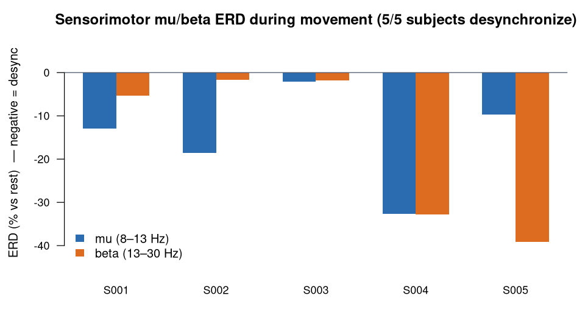

> **What this case shows** — when a hand moves, sensorimotor **mu** (8–13 Hz) and
> **beta** (13–30 Hz) power over the motor cortex drops relative to rest —
> event-related desynchronization (ERD), the signal a motor brain–computer
> interface reads — in **5 of 5** eegmmidb subjects. **What reproduces, and what
> doesn't** — the *desynchronization itself* (mu and beta power drop during
> movement) reproduces in all five subjects and is stable on re-run. What does
> **not** reproduce reliably per subject is the textbook *contralateral
> lateralization* — a bigger drop over the hemisphere opposite the moving hand: at
> single-subject signal-to-noise, the C3-vs-C4 asymmetry is present only as a noisy
> tendency, so we report it and do not claim it. The absolute power values also
> move with the recipe. **How to read it** — each bar is a subject's mean mu (or
> beta) power change from rest to movement; a negative value means power dropped —
> that drop is the ERD.

::: {.callout-tip title="The recipe you'll learn"}
**Workflow** — answer *"does a rhythm change when the subject does something?"*:
**segment** the recording by the dataset's own event markers into the two
conditions → **band-limit** → quantify with `bandPower(relative = FALSE)` →
**contrast** movement against a matched rest baseline.
**Way of thinking** — take the segments from the task structure, not by eye; match
the rest baseline to the movement condition; and choose absolute power
(`relative = FALSE`) here, because ERD is a drop in a rhythm's absolute power, not
a change in which rhythm dominates. Claim only the quantity your signal-to-noise
supports (the desync), not the fragile one (lateralization).
**Ecosystem usage** — the same functions per role, I/O → preprocessing → analysis
(`readEDF` → `butterworthFilter` → `bandPower`), connected by the shared data
model; the events that define the segments ride along in the data model's
metadata. The final section turns this into a step-by-step you can adapt to your
own task design.
:::

## Proposition

During real hand movement, absolute sensorimotor (C3/C4) **mu** (8–13 Hz) and
**beta** (13–30 Hz) power drops relative to rest — **event-related
desynchronization (ERD)**, the signal a motor BCI decodes — in **5 of 5** eegmmidb
subjects for mu (mean **−15.2 %**) and 5/5 for beta, reproduced end-to-end by the
ecosystem across all ten runs. Contralateral lateralization is present but noisy
per subject and is *not* claimed; the reported, robust quantity is the
desynchronization itself.

## Question & goal

**The question is the one this dataset was built to answer.** eegmmidb was created
with BCI2000 to decode voluntary hand movement and imagery from scalp EEG (Schalk
et al., 2004) — a brain–computer interface. What a motor BCI actually reads is the
**event-related desynchronization** of the sensorimotor rhythms: when a hand
moves, mu and beta power over the contralateral motor cortex drops. So we ask the
dataset's own question directly: does the ecosystem recover that ERD — the
decodable signal — *reproducibly* from the real-movement runs, across subjects?

## Challenge & approach

ERD is a *contrast* (movement vs rest), and it is easy to get wrong: the segments
must come from the task structure, the band must be the sensorimotor mu/beta, and
the rest baseline must be matched. The dataset supplies its own event annotations
(`T0` rest, `T1`/`T2` left/right fist), so for each subject the three real-movement
runs (**R03/R07/R11**) are segmented into rest vs movement and concatenated per
condition (channels **C3/C4**). The same two-step recipe is then run on each
condition:

```
butterworthFilter(low = 1, high = 45)  →  bandPower(relative = FALSE)   # alpha col = mu (8–13 Hz)
```

Note `relative = FALSE`: ERD is a drop in the *absolute* power of a rhythm, so we
read absolute band power, not each band's share. ERD is then a comparison of the
movement vs rest band powers. (The segmentation into conditions uses the dataset's
own annotations; the recipe the case reproduces and re-runs is the filter →
band-power step on each condition.)

## Data

**EEG Motor Movement/Imagery Database** (eegmmidb), subjects **S001–S005**,
real-movement runs **R03/R07/R11** (open/close the cued fist), 64 channels, 160 Hz
— public on PhysioNet (<https://physionet.org/content/eegmmidb/>). The exact
recordings used are listed in
[`artifacts/data_sources.json`](artifacts/data_sources.json). *Schalk G, et al.
IEEE Trans Biomed Eng. 2004;51(6):1034–43; Goldberger AL, et al. Circulation.
2000;101(23):e215–20.* Licensed ODC-BY 1.0.

## Results



*How to read this:* each row is one subject; the ERD columns are the percent change
in mu (or beta) power from rest to movement — a negative value means the rhythm
desynchronized (power dropped) during movement.

**Movement vs rest, per subject** ([`artifacts/erd_panel.csv`](artifacts/erd_panel.csv)):

| Subject | mu ERD (%) | beta ERD (%) | mu desync? | beta desync? |
|---|---|---|---|---|
| S001 | −12.9 | −5.3 | ✓ | ✓ |
| S002 | −18.5 | −1.6 | ✓ | ✓ |
| S003 | −2.1 | −1.8 | ✓ | ✓ |
| S004 | −32.7 | −32.8 | ✓ | ✓ |
| S005 | −9.7 | −39.2 | ✓ | ✓ |

- **Mu desynchronizes in 5/5 subjects** (mean −15.2 %) and **beta in 5/5** — the
  sensorimotor rhythms drop during movement, the classic ERD.
- Per-channel values (C3 vs C4;
  [`artifacts/erd_panel.csv`](artifacts/erd_panel.csv)) show the expected
  contralateral tendency is present but noisy at this scale, so only the
  desynchronization — what BCIs exploit — is claimed.

The lead run (S001 rest) reports absolute C3 band power — including mu (alpha
band) **323.88** and beta **347.20** — each traced to its source table
([`bundle/verification_report.json`](bundle/verification_report.json)).

## Conclusion

The ecosystem reproduces the phenomenon eegmmidb was built to study — sensorimotor
mu/beta ERD during hand movement, the decodable motor-BCI signal — across all ten
runs, with mu and beta desynchronizing in every one of the five subjects, computed
end-to-end from the raw recordings. The transferable lesson: segment by the
dataset's own events, read absolute power, and claim only the contrast your
signal-to-noise supports.

## Open questions

None. Sensorimotor mu/beta ERD during movement (Pfurtscheller & Lopes da Silva,
1999) is the established basis of motor BCIs — exactly what eegmmidb was built to
study — used here to demonstrate a reproducible contrast on public EEG. The
escalation-to-paper path is reserved for genuinely unresolved questions.

## Using this in your own analysis

This case is a worked example of an **event-segmented, absolute-power contrast** —
the pattern for any "does a rhythm change when the subject does something?"
question.

**The general recipe:**

1. **Segment** the recording into conditions using the dataset's own event markers
   — here rest (`T0`) vs movement (`T1`/`T2`) — rather than by eye.
2. **Pick the channels** over the rhythm's generator — here C3/C4 over
   sensorimotor cortex.
3. **Filter** to the analysis band and **quantify** with
   `bandPower(relative = FALSE)` — absolute power, because ERD is an absolute drop.
4. **Contrast** movement against the matched rest baseline; a negative percent
   change is the desynchronization.

**Which functions, and how they compose.** Each step is one ecosystem function,
picked by *role* — I/O → preprocessing → analysis:

| Step | Function | Package |
|---|---|---|
| load an EDF recording (with its event annotations) | `readEDF()` | PhysioIO |
| band-limit the signal | `butterworthFilter()` | PhysioPreprocess |
| absolute spectral power per band | `bandPower()` | PhysioAnalysis |

They chain because each returns a `PhysioExperiment` the next one accepts — the
event annotations travel in that object's metadata, so the segmentation and the
band power stay attached to the same signal instead of drifting apart in
bookkeeping.

**Choosing the parameters.**

- **Channel** — put electrodes over the rhythm's generator: C3/C4 for the
  sensorimotor mu/beta (occipital for alpha, frontal for slow waves).
- **Filter band (`low`, `high`)** — wide enough to contain both mu and beta
  (1–45 Hz covers 8–30 Hz); the 45 Hz high cut removes line noise.
- **`relative = FALSE`** — the key choice here: ERD is a drop in a rhythm's
  *absolute* power, so read absolute band power. Use `relative = TRUE` only when
  you care which rhythm dominates (e.g. the alpha cases).
- **Segments** — take them from the dataset's event codes (`T0`/`T1`/`T2`), and
  match the rest baseline to the movement window so a difference in duration or
  state does not masquerade as ERD.
- **Which quantity to claim** — claim the desynchronization (robust across
  subjects); report but don't over-claim the contralateral lateralization when
  single-subject SNR is low.

**Applying it to your own hypothesis.** Swap the event codes for your task's
markers, the channels for your rhythm's location, and the band you read. The
event-segmented contrast generalises to any stimulus- or task-locked design; the
same band-power machinery underlies the eyes-closed/open contrast
([`eeg-berger-eegmmidb`](../eeg-berger-eegmmidb/)) and its cohort version
([`eeg-alpha-reactivity-eegmmidb`](../eeg-alpha-reactivity-eegmmidb/)).

**The recipe, copy-runnable:**

```r
library(PhysioIO); library(PhysioPreprocess); library(PhysioAnalysis)

# absolute sensorimotor band power for one condition PE (C3/C4), mu = alpha 8-13 Hz
band_power_C34 <- function(pe) {
  f <- butterworthFilter(pe, low = 1, high = 45)   # PhysioPreprocess
  bandPower(f, relative = FALSE)                    # PhysioAnalysis: delta..gamma per channel
}

# for each subject: readEDF R03/R07/R11, split by the T0/T1-T2 annotations into
# rest vs movement on C3/C4, then compare mu (alpha) and beta:
rest <- band_power_C34(rest_condition_PE)   # from the T0 segments
move <- band_power_C34(move_condition_PE)   # from the T1/T2 segments
mu_ERD <- (move$alpha - rest$alpha) / rest$alpha * 100   # < 0 = desynchronization
```

**Auditing the numbers.** For readers who want to verify rather than trust: every
number on this page — the lead spectrum and the per-subject ERD — is re-derived
from the stored results by `audit.py`, with the full machine-checkable record in
[`bundle/`](bundle/) and [`artifacts/`](artifacts/).
