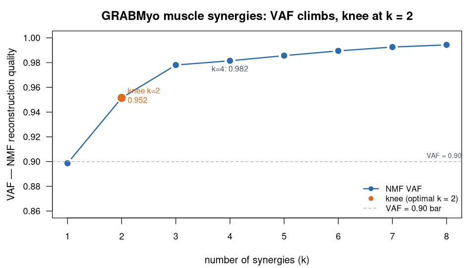

> **What this case shows** — non-negative matrix factorisation of real GRABMyo
> forearm EMG recovers a small set of **muscle synergies** that reconstruct the
> activation envelopes with high fidelity, and whose weights **reproduce across
> independent halves** of the recording. **What reproduces, and what doesn't** —
> with a robust *best-of-restarts* NMF, **all four synergies reproduce**
> (best-matched split-half correlations **0.85–0.98**, pooled **ICC(A,1) = 0.89**,
> 95% CI 0.82–0.94). What does **not** transfer is a *single-run* NMF: because the
> factorisation is non-convex, one random start gives unstable split-half
> correlations (the lowest-variance synergy can look weak) — an **initialisation
> artifact**, not real structure, which is why you run several restarts. Fitting
> four synergies still **over-extracts** past the two-synergy VAF knee, but that is
> a *parsimony* argument, not a reproducibility one. **How to read it** — in the
> figure, the VAF curve shows how well *k* synergies reconstruct the envelopes; the
> knee (k = 2) is where the curve stops climbing steeply. In the table, each
> split-half correlation is how faithfully a synergy re-appears in an independent
> half (1 = identical); the ICC is the standard agreement statistic over the weights.

::: {.callout-tip title="The recipe you'll learn"}
**Workflow** — answer *"how many coordinated activation patterns underlie a
multi-muscle task, and are they real?"* in three moves: **envelope** the EMG →
**factorise** with NMF, sweeping the synergy count for the VAF knee → **test**
each synergy's stability across independent data halves.
**Way of thinking** — a synergy earns belief only if the non-negative model
reconstructs the envelopes *and* the synergy re-appears in data it was not fit
on; choose the count by the VAF **knee**, not the highest VAF; and, because NMF
is non-convex, judge reproducibility with a *robust best-of-restarts* fit and the
standard agreement statistic (ICC), not one lucky (or unlucky) random start.
**Ecosystem usage** — chain one function per role, I/O → preprocessing →
analysis (`readWFDB` → `emgEnvelope` → `muscleSynergyOrder` / `muscleSynergy` →
`synergyCompare`), letting the shared `PhysioExperiment` data model connect them.
The final section turns this into a step-by-step you can adapt to your own EMG.
:::

## Proposition

Non-negative matrix factorisation of real GRABMyo forearm EMG yields
high-quality muscle synergies (**4-synergy VAF = 0.982**; a **2-synergy**
solution already clears VAF ≥ 0.90) whose weights **reproduce across independent
data halves** — all four synergies with best-matched correlations **0.85–0.98**
and a pooled **ICC(A,1) = 0.89** (95% CI 0.82–0.94) under a robust
best-of-restarts NMF.

## Question & goal

**The question comes from the dataset's own design.** GRABMyo was built as a
multi-day dataset of forearm and wrist surface EMG for **hand-gesture recognition
and biometrics** (Pradhan, He, Jiang, 2022) — many muscles recorded together
while the hand forms distinct gestures. Behind gesture recognition sits the
motor-control question those recordings encode: the nervous system is thought to
drive many muscles through a **few coordinated activation patterns** — *muscle
synergies* — rather than commanding each muscle independently. So we ask the
dataset's underlying question directly: **how many synergies underlie the
gestures, and are they stable structure rather than an artefact of one fit?** A
synergy analysis has to earn two things at once — reconstruct the signal, and
reproduce out of sample — and we check both.

## Challenge & approach

Surface-EMG synergies are only meaningful if the non-negative model reconstructs
the envelopes well *and* the synergies are not artefacts of one data split. The
recipe factorises the rectified/enveloped EMG with NMF, sweeps the synergy count
for the VAF knee, and cross-validates by correlating synergies extracted from
independent halves of the recording:

```
readWFDB  →  emgEnvelope  →  muscleSynergyOrder (VAF knee)  →  muscleSynergy (NMF)  →  synergyCompare (split-half)
```

The count is chosen by the **knee** — the first *k* whose reconstruction clears
VAF ≥ 0.90 — not by the largest VAF, because reconstruction keeps creeping up
with more components long after the real structure is captured. Stability is then
tested the hard way: extract synergies on each half separately and ask whether
they match — quantified both by best-matched correlation and by the intraclass
correlation coefficient **ICC(A,1)** (the standard agreement statistic). Because
NMF is non-convex, the split-half fit uses a **best-of-restarts** initialisation
(20 restarts); a single random start can spuriously depress the lowest-variance
synergy.

## Data

**GRABMyo v1.1.0** (PhysioNet) — public
(<https://physionet.org/content/grabmyo/1.1.0/>); record
`session1_participant1_gesture10_trial1`, 12 forearm channels @ 2048 Hz. *Pradhan
A, He J, Jiang N. Multi-day dataset of forearm and wrist electromyogram for hand
gesture recognition and biometrics. Sci Data. 2022;9:733.*

## Results



*How to read this:* VAF is the fraction of envelope variance the synergies
reconstruct; the dashed line is the VAF ≥ 0.90 bar, and the knee (k = 2, orange)
is the first count that clears it — where adding synergies stops buying
reconstruction.

**Reconstruction quality** ([`artifacts/vaf_analysis.csv`](artifacts/vaf_analysis.csv)):
NMF VAF climbs 0.90 → 0.95 → 0.98 → **0.982** for k = 1…4; the VAF ≥ 0.90 knee is
at **k = 2** ([`artifacts/pipeline_summary.csv`](artifacts/pipeline_summary.csv)).

**Split-half reproducibility**
([`artifacts/synergy_split_half_stability.csv`](artifacts/synergy_split_half_stability.csv),
[`icc`](artifacts/synergy_split_half_icc.csv)), with a robust best-of-restarts NMF:

| Best-matched synergy pair | Correlation | ICC(A,1) [95% CI] |
|---|---|---|
| 1 | 0.985 | 0.98 [0.94, 0.99] |
| 2 | 0.875 | 0.87 [0.62, 0.96] |
| 3 | 0.853 | 0.84 [0.55, 0.95] |
| 4 | 0.848 | 0.84 [0.54, 0.95] |

**All four** synergies reproduce across halves (weakest correlation **0.85**),
with a pooled **ICC(A,1) = 0.89** (95% CI 0.82–0.94) over the synergy weights —
good-to-excellent agreement
([`artifacts/synergy_split_half_icc_pooled.csv`](artifacts/synergy_split_half_icc_pooled.csv)).
A *single-run* NMF instead gives unstable correlations in which the
lowest-variance synergy can look weak — an initialisation artifact of non-convex
optimisation, not real over-extraction. The 4-synergy fit does over-extract past
the **2-synergy** VAF knee, but that is a *parsimony* point, not a reproducibility
one.

## Conclusion

On real GRABMyo EMG the ecosystem extracts high-VAF muscle synergies whose
weights reproduce across data halves — all four with a pooled ICC(A,1) of 0.89 —
alongside a parsimonious 2-synergy VAF knee. The transferable lesson: read the
synergy count from the VAF knee, quantify reproducibility with a robust
best-of-restarts fit and the ICC, and don't mistake a single-run initialisation
wobble for real instability.

## Open questions

Fitting four synergies over-extracts past the two-synergy VAF ≥ 0.90 optimum
(parsimony), yet the four-synergy weights still reproduce across halves under a
robust best-of-restarts NMF (pooled ICC 0.89). The "weak fourth synergy" seen with
a single-run NMF is an initialisation artifact of non-convex optimisation, not an
instability of the structure. Documented, not escalated.

## Using this in your own analysis

This case is a worked example of a **muscle-synergy analysis** — the pattern for
any "how many coordinated activation patterns underlie this multi-muscle task,
and are they real?" question.

**The general recipe** (three steps, the same for any synergy extraction):

1. **Envelope** each EMG channel — rectify and smooth so the analysis sees muscle
   *activation* over time, not the raw interference pattern.
2. **Factorise** the multi-muscle envelope with NMF, sweeping the synergy count,
   and pick the count at the **VAF knee** (the first *k* that clears your
   reconstruction bar) rather than the highest VAF.
3. **Test stability** by extracting synergies on two independent halves of the
   recording and correlating the best-matched pairs; keep only the synergies that
   reproduce.

**Which functions, and how they compose.** Each step is one ecosystem function,
picked by *role* — I/O → preprocessing → analysis:

| Step | Function | Package |
|---|---|---|
| load the forearm EMG recording | `readWFDB()` | PhysioIO |
| rectify + smooth to activation envelopes | `emgEnvelope()` | PhysioEMG |
| sweep the synergy count for the VAF knee | `muscleSynergyOrder()` | PhysioEMG |
| extract *N* muscle synergies (NMF) | `muscleSynergy()` | PhysioEMG |
| match + correlate synergies across halves | `synergyCompare()` | PhysioEMG |

They chain because each returns (or consumes) a `PhysioExperiment` — the shared
data model is what lets the tools snap together, so you compose an analysis by
naming the steps, not by reshaping matrices between them.

**Choosing the parameters.**

- **Envelope (`method`, `window_ms`)** — `"rms"` with a ~50 ms window turns the
  rectified EMG into a smooth activation envelope; widen the window for slow
  sustained tasks, narrow it for fast bursts.
- **Synergy count (`max_synergies`, `vaf_threshold`)** — do **not** chase the
  highest VAF; take the knee where added synergies stop buying reconstruction
  (here VAF ≥ 0.90 is first met at **k = 2**). Fitting more (k = 4) over-extracts
  on *parsimony* grounds — but, run robustly, the extra synergies still reproduce.
- **`n_restarts`** — NMF is non-convex, so a single random start is unreliable for
  a *reproducibility* claim; use a best-of-restarts fit (here 20) with a fixed seed
  so the split-half comparison reflects real structure, not initialisation luck.
- **`method = "nmf"`** — NMF is the right model for surface-EMG synergies because
  weights and activations are both non-negative, matching muscle activation; PCA
  and ICA allow negative weights and reconstruct these envelopes poorly (VAF < 0
  here), so they are diagnostics, not the answer.
- **Split location** — split the recording in half over time and process both
  halves with the *identical* recipe, or a method difference will masquerade as
  instability.

**Applying it to your own hypothesis.** Swap the GRABMyo record for your own
multi-muscle EMG, keep the envelope → NMF → split-half recipe, read the synergy
count off the VAF knee, and report only the synergies that reproduce. The same
coordination question generalises to the inter-muscle connectivity *network* on
this data ([`emg-network-grabmyo`](../emg-network-grabmyo/)) and down to the
individual motor-unit level ([`hdemg-mu-openhdemg`](../hdemg-mu-openhdemg/)).

**The recipe, copy-runnable:**

```r
library(PhysioIO); library(PhysioEMG)

# 1. load the forearm EMG and turn each channel into an activation envelope
pe  <- readWFDB("session1_participant1_gesture10_trial1")   # GRABMyo: 12 ch @ 2048 Hz
env <- emgEnvelope(pe, method = "rms", window_ms = 50)       # rectify + smooth

# 2. how many synergies? sweep k and take the VAF >= 0.90 knee
ord <- muscleSynergyOrder(env, max_synergies = 8, vaf_threshold = 0.90)  # -> optimal_n = 2
syn <- muscleSynergy(env, n_synergies = 4, method = "nmf")               # 4-synergy VAF 0.982

# 3. split-half stability: re-extract on each half with a robust best-of-restarts
#    NMF (single-run is initialisation-dependent), then match and correlate
sig  <- SummarizedExperiment::assay(env, "envelope")        # time x 12 muscles
half <- nrow(sig) %/% 2
h1 <- muscleSynergy(env[seq_len(half), ],        n_synergies = 4, method = "nmf", n_restarts = 20, seed = 42)
h2 <- muscleSynergy(env[(half + 1):nrow(sig), ], n_synergies = 4, method = "nmf", n_restarts = 20, seed = 42)
synergyCompare(h1, h2)$correlation   # best-matched: all four reproduce, 0.85-0.98 (pooled ICC 0.89)
```

**Auditing the numbers.** For readers who want to verify rather than trust: the
VAF sweep, the chosen synergy count, every split-half correlation, and the ICC
with its confidence interval live in [`artifacts/`](artifacts/), and `audit.py`
re-checks each number on this page against those files.
