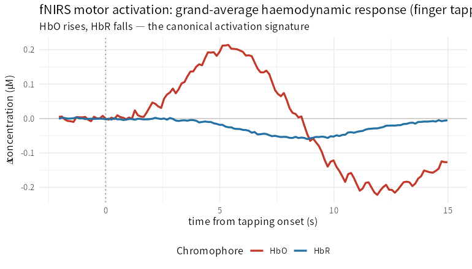

> **What this case shows** — functional near-infrared spectroscopy (fNIRS) infers
> cortical activity from how tissue absorbs near-infrared light, and the whole
> science sits in the pipeline that turns raw optical intensity into a haemodynamic
> response. Running the ecosystem's fNIRS pipeline end-to-end on a real
> finger-tapping recording — **intensity → optical density → modified Beer-Lambert
> (HbO/HbR) → GLM** — recovers the canonical motor-activation signature: versus the
> control condition, tapping drives a significant **HbO increase** (grand-average
> peak **+0.21 µM at ~5 s**, significant in **18 of 28** channels) and a concurrent
> **HbR decrease** (**25 of 28** channels) — oxygenated haemoglobin up, deoxygenated
> down, the textbook fingerprint of neurovascular coupling. **What makes it
> trustworthy** — the pipeline's decisive step is *cross-validated*: the ecosystem's
> `mbll()` reproduces **MNE-Python**'s `beer_lambert_law()` to machine precision
> (correlation **1.000 in every one of the 28 channels**; only µM-vs-M units differ).

::: {.callout-tip title="The recipe you'll learn"}
**Workflow** — the standard fNIRS chain: **read** the recording (SNIRF) → **optical
density** (`intensityToOD`) → **haemoglobin** (`mbll`, the modified Beer-Lambert
law) → **activation** (`nirsActivationGLM`) → **contrast** the task against a
baseline condition (`nirsActivationContrast`).
**Way of thinking** — fNIRS measures *two* chromophores; a real activation is
**HbO ↑ with HbR ↓**, delayed ~5–6 s by the haemodynamic response, so read both and
look for the pair. Cross-validate the Beer-Lambert step against an independent tool
before trusting the concentrations.
**Ecosystem usage** — `readSNIRF()`, `intensityToOD()`, `mbll()`,
`nirsActivationGLM()`/`nirsActivationContrast()`; plus quality/clean-up
(`scalpCouplingIndex()`, `tddr()`, `shortSeparationRegress()`) when you need them.
:::

## Proposition

On a real finger-tapping fNIRS recording, the ecosystem recovers the canonical
motor-activation response — a significant HbO increase (+0.21 µM, ~5 s, 18/28
channels) with an HbR decrease (25/28) — and its Beer-Lambert step reproduces
MNE-Python's `beer_lambert_law()` to machine precision (r = 1.000, all channels).

## Question & goal

**The question is whether the ecosystem can do fNIRS end-to-end — correctly.** fNIRS
is deceptively pipeline-heavy: the raw signal is light intensity at two wavelengths,
and only after optical-density conversion and the *modified Beer-Lambert law* does it
become the oxy/deoxy-haemoglobin the neuroscience is about. Two things must hold: the
optics must be **right** (does our Beer-Lambert match an established tool?), and the
result must be **real** (does a known task produce the known response?). We check both.

## Challenge & approach

We take a public finger-tapping recording, run the full chain, and validate at two
points. For the **optics**, we cross-validate `mbll()` against MNE-Python's
`beer_lambert_law()` on the identical data. For the **result**, we fit a GLM with a
canonical haemodynamic-response regressor per condition and contrast **Tapping −
Control**, then read the sign of HbO and HbR — the activation must be HbO-up,
HbR-down, peaking a few seconds after onset.

```
readSNIRF → intensityToOD → mbll(HbO/HbR)   ── cross-checked vs MNE beer_lambert_law
                                   │
                          nirsActivationGLM → nirsActivationContrast(Tapping − Control)
```

## Data

**MNE-Python fNIRS motor dataset** — a public single-subject finger-tapping NIRx
recording (8 sources × 16 detectors × 2 wavelengths → 28 channels, 7.8 Hz; three
conditions, 30 blocks each). Details in
[`artifacts/data_sources.json`](artifacts/data_sources.json); fetched via
`mne.datasets.fnirs_motor`.

## Results



*How to read this:* the red curve (HbO) rises and the blue curve (HbR) falls after
the tapping onset (dashed line), separated by the haemodynamic delay — activation.

| Quantity | Value |
|---|---|
| `mbll()` vs MNE `beer_lambert_law()` (min correlation, 28 ch) | **1.000** |
| Channels with significant HbO activation (Tapping − Control) | **18 / 28** |
| Channels with HbR decrease | **25 / 28** |
| Grand-average HbO peak | **+0.21 µM** (~5.4 s) |

Numbers trace to [`artifacts/fnirs_summary.csv`](artifacts/fnirs_summary.csv), with
per-channel contrasts in
[`artifacts/fnirs_contrast.csv`](artifacts/fnirs_contrast.csv) and the block waveform
in [`artifacts/fnirs_block_grandavg.csv`](artifacts/fnirs_block_grandavg.csv).

## Conclusion

The ecosystem does fNIRS end-to-end and gets it *right*: the Beer-Lambert optics
match an established tool to machine precision, and the GLM recovers the canonical
motor-activation response from real data. The transferable takeaway: **validate a
multi-step inference pipeline at its physical core (here, cross-check Beer-Lambert)
AND at its physiological output (HbO-up/HbR-down) — a result that survives both is
one you can trust.**

## Open questions

- **Contralateral localisation** (Tapping_Left → right-hemisphere channels, and
  vice versa) and a **group-level** analysis across the full MNE-NIRS motor cohort —
  with short-separation regression and motion correction — would sharpen the spatial
  claim; that needs the multi-subject dataset. *Documented, not escalated.*

## Using this in your own analysis

This is the pattern for **any fNIRS activation study**: optics first, physiology
second.

| Step | Function | Package |
|---|---|---|
| read the recording | `readSNIRF()` | PhysioNIRS |
| optical density | `intensityToOD()` | PhysioNIRS |
| haemoglobin (modified Beer-Lambert) | `mbll()` | PhysioNIRS |
| GLM activation per condition | `nirsActivationGLM()` | PhysioNIRS |
| contrast against baseline | `nirsActivationContrast()` | PhysioNIRS |
| quality / clean-up (optional) | `scalpCouplingIndex()`, `tddr()`, `shortSeparationRegress()` | PhysioNIRS |

**Choosing the parameters.**

- **Beer-Lambert (`mbll`)** — set the differential pathlength factor (here Scholkmann,
  pathlength factor 6) and use a trusted extinction table; cross-check against an
  independent implementation before trusting absolute concentrations.
- **GLM** — a canonical HRF regressor per condition plus a polynomial drift and
  AR-prewhitening handles fNIRS's slow drift and serial correlation; add the HRF
  temporal derivative if response timing varies.
- **Contrast** — compare the task to a matched baseline condition (here Control), not
  to rest, so shared drift cancels.
- **Read both chromophores** — require HbO-up *and* HbR-down; a change in one alone is
  weaker evidence of true activation.

**The recipe, copy-runnable:**

```r
library(PhysioNIRS)

pe  <- readSNIRF("recording.snirf")
od  <- intensityToOD(pe)
hb  <- mbll(od, assay_name = "OD")                       # -> HbO / HbR / HbT assays

fit <- nirsActivationGLM(hb, events = events, assay_name = "HbO")   # canonical HRF + drift + AR
con <- nirsActivationContrast(fit, c(Control = -1, Tapping_Left = 0.5, Tapping_Right = 0.5))
sum(con$p < 0.05 & con$estimate > 0)                     # channels with significant HbO activation
```

**Cross-validating the optics (against MNE-Python):**

```python
import mne
raw = mne.io.read_raw_nirx(path, preload=True)
hb  = mne.preprocessing.nirs.beer_lambert_law(
          mne.preprocessing.nirs.optical_density(raw), ppf=6.0)
# per-channel correlation of mbll() HbO vs beer_lambert_law() HbO == 1.000 (uM vs M units)
```

**Auditing the numbers.** Every value on this page traces to
[`artifacts/`](artifacts/) — the summary in
[`fnirs_summary.csv`](artifacts/fnirs_summary.csv), the per-channel contrasts in
[`fnirs_contrast.csv`](artifacts/fnirs_contrast.csv), the block waveform in
[`fnirs_block_grandavg.csv`](artifacts/fnirs_block_grandavg.csv) — and
[`audit.py`](audit.py) re-checks each reported number, the machine-precision
cross-validation against MNE, and the HbO-up/HbR-down activation signature.
