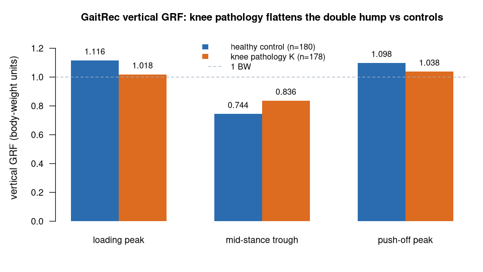

> **What this case shows** — from a large public force-plate dataset, the
> ecosystem recovers the classic **knee-pathology gait signature** in the vertical
> ground-reaction force (GRF): compared with healthy controls, the knee group has
> a **lower loading peak (1.116 → 1.019 BW)** and a **raised mid-stance trough
> (0.744 → 0.836 BW)** — a flatter GRF, the hallmark of reduced weight-acceptance
> modulation. **What reproduces, and what doesn't** — the *contrast* in the
> **measured** vertical GRF reproduces the established clinical pattern between the
> two cohorts. It does **not** extend to joint kinematics or stride timing:
> GaitRec supplies no measured joint-angle tracks, so those are out of scope here
> — no knee-angle or ICC claims are made. **How to read it** — compare each
> landmark between the control and knee bars; the shrinking peaks and the rising
> trough together *are* the pathological signature.

::: {.callout-tip title="The recipe you'll learn"}
**Workflow** — answer *"does this clinical feature differ between two groups?"* in
four moves: **load** each cohort's force traces → **filter** them the same way →
**time-normalise** every stride to the stance phase → **contrast** the landmarks.
**Way of thinking** — process both cohorts with the *identical* recipe (or a
method difference masquerades as a group difference); express force in
**body-weight units** so subjects of different mass are comparable; and use only
the *measured* channel — GaitRec's absent kinematics stay out of the claim.
**Ecosystem usage** — chain one function per role, I/O → preprocessing → analysis
(load GRF → `filterGRF` → `normalizeMovement` → read landmarks), letting the
shared `PhysioExperiment` data model connect them. The final section turns this
into a step-by-step you can adapt to your own cohorts.
:::

## Proposition

On real GaitRec vertical ground-reaction force, the ecosystem reproduces the
knee-pathology gait signature versus healthy controls: a **reduced loading peak
(1.019 vs 1.116 BW)** and a **raised mid-stance trough (0.836 vs 0.744 BW)** —
the flattened GRF double-hump of reduced weight-acceptance modulation, computed
end-to-end from the public recordings.

## Question & goal

**The question comes from the dataset's own purpose.** GaitRec (Horsak et al.,
2020, *Sci Data*) was assembled as a large-scale ground-reaction-force database of
**healthy and impaired gait**, built to support gait analysis and the automated
classification of gait pathology from GRF. Its premise is that the vertical GRF
waveform — the double-humped stance-phase force curve — carries the mechanical
signature of how a patient loads and unloads the limb. So we ask the database's
own question: does the vertical GRF carry the clinical signature of gait
pathology, and does the ecosystem recover it as a clean cohort contrast — the
reduced weight-acceptance modulation of a knee-pathology group versus controls?

## Challenge & approach

A cohort contrast is only as trustworthy as its two arms and its scaling. Vertical
GRF must be **time-normalised** to the stance phase (so strides of different
duration align point-for-point) and **body-weight scaled** (so a heavier subject's
larger force does not read as a group effect), and only the *measured* signal may
be used — GaitRec provides no joint kinematics, so no knee-angle or ICC claims are
made. The recipe is the same for both cohorts:

```
[load GRF]  →  filterGRF(cutoff = 20)  →  normalizeMovement(method = "cycle")  →  landmarks (peaks / trough)
```

Each stride is filtered (20 Hz Butterworth), time-normalised to 0–100 % stance in
body-weight units, and reduced to three landmarks — the loading peak, the
mid-stance trough, and the push-off peak — which are then averaged within each
cohort and contrasted, with a first-peak effect size for scale
([`artifacts/gaitrec_grf_realdata_validation.csv`](artifacts/gaitrec_grf_realdata_validation.csv)).

## Data

**GaitRec** (Horsak et al., 2020, *Sci Data*) — a large-scale ground-reaction-force
dataset of healthy and impaired gait; here the vertical GRF for healthy controls
(HC, n = 180) versus the knee-pathology cohort (K, n = 178) — public on figshare
(<https://doi.org/10.6084/m9.figshare.c.4788012>). The exact files used are the
processed vertical-GRF tracks (`GRF_F_V_PRO_left/right`) with the clinical class
labels in `GRF_metadata.csv`. *Horsak B, et al. GaitRec, a large-scale ground
reaction force dataset of healthy and impaired gait. Sci Data. 2020;7:143.*

## Results



*How to read this:* each bar is a group-mean landmark of the stance-phase force
curve in body-weight units (1 BW = the subject's static weight); a healthy curve
has two peaks above 1 BW separated by a dip below it.

Vertical-GRF landmarks, body-weight units
([`artifacts/gaitrec_grf_realdata_validation.csv`](artifacts/gaitrec_grf_realdata_validation.csv);
group-mean waveforms in
[`artifacts/gaitrec_grf_group_comparison.csv`](artifacts/gaitrec_grf_group_comparison.csv)):

| Landmark | Healthy control | Knee pathology |
|---|---|---|
| First (loading) peak | 1.116 | **1.019** |
| Mid-stance trough | 0.744 | **0.836** |
| Second (push-off) peak | 1.098 | 1.038 |

Patients show lower loading/push-off peaks and a higher mid-stance trough — a
flatter GRF, the hallmark of reduced weight-acceptance and push-off modulation.
The first-peak difference is a large effect (Cohen's *d* = 1.045).

## Conclusion

On real GaitRec GRF the ecosystem reproduces the expected knee-pathology pattern
of reduced GRF modulation relative to healthy controls — a clinically meaningful
contrast recovered from public data, computed end-to-end and traced to the
artifacts. The transferable takeaway: a group contrast in a normalised, unit-scaled
clinical waveform is a reliable way to surface pathology, provided both arms share
one recipe and the claim stays inside the measured signal.

## Open questions

None escalated. This reproduces an established clinical GRF pattern on public data.
Joint-kinematics reproducibility is deliberately out of scope for GaitRec: the
source measures no joint angles, so the case excludes any synthetic
kinematics/timing tracks and makes no ICC or knee-angle claim. The
escalation-to-paper path is reserved for genuinely unresolved questions.

## Using this in your own analysis

This case is a worked example of a **clinical cohort contrast** — the pattern for
any *"does feature X differ between group A and group B?"* question on a normalised
waveform.

**The general recipe** (four steps, the same for both cohorts):

1. **Load** each subject's force trace into a `PhysioExperiment`, keeping the group
   label and body mass alongside it.
2. **Filter** the force with a Butterworth lowpass (here 20 Hz) — the same filter
   for every subject in both arms.
3. **Time-normalise** each stride to 0–100 % of the stance phase and divide by body
   weight, so waveforms of different duration and different subject mass align and
   compare.
4. **Reduce** each waveform to its landmarks (loading peak, mid-stance trough,
   push-off peak), average within each cohort, and contrast — with an effect size
   for scale.

**Which functions, and how they compose.** Each step is one ecosystem function,
picked by *role* — I/O → preprocessing → analysis:

| Step | Function | Package |
|---|---|---|
| load the vertical GRF into a `PhysioExperiment` | `PhysioExperiment()` / `readCSV()` | PhysioCore / PhysioIO |
| band-limit the force trace | `filterGRF(cutoff = 20)` | PhysioMoCap |
| time-normalise each stride to stance | `normalizeMovement(method = "cycle")` | PhysioMoCap |
| effect size between cohorts | `cohensD()` | PhysioMoCap |

They chain because each step takes and returns the same `PhysioExperiment`-backed
data — the shared data model is what lets the tools snap together, so you compose
the analysis by naming the steps, not by reshaping data between them.

**Choosing the parameters.**

- **Filter cutoff (`cutoff = 20`)** — 20 Hz Butterworth lowpass is the biomechanics
  convention for vertical GRF (Winter): it removes force-plate noise while keeping
  the loading/push-off transients intact. Lower it only for very smooth signals.
- **`norm_length = 101`** — normalise to 101 points (0–100 % stance), the standard
  gait grid, so every stride and both cohorts are sampled on the same axis and can
  be averaged point-for-point.
- **Body-weight scaling** — divide force (N) by body weight (mass × 9.81) so peaks
  are *relative*, comparable across subjects of different mass; use absolute
  Newtons only when total force, not gait shape, is the question.
- **Landmark windows** — read the loading peak in early stance, the trough around
  mid-stance, and the push-off peak in late stance; widen the windows if your
  population walks with atypical timing.
- **Cohorts** — pick two clinically meaningful groups (here HC vs K) with enough
  subjects per arm for a stable mean (here 180 vs 178).

**Applying it to your own hypothesis.** Swap the two cohorts for your groups, the
force trace for your waveform, and the landmarks for the features that matter in
your domain. The same *matched-recipe, two-arm contrast* generalises directly to
other physiological comparisons — e.g. a two-condition spectral contrast in
[`eeg-berger-eegmmidb`](../eeg-berger-eegmmidb/), or the same contrast run across a
whole cohort in [`eeg-alpha-reactivity-eegmmidb`](../eeg-alpha-reactivity-eegmmidb/).

**The recipe, copy-runnable:**

```r
library(PhysioCore); library(PhysioMoCap)

# one subject: real vertical GRF (Newtons) -> body-weight, stance-normalised landmarks
grf_landmarks <- function(grf_N, mass_kg, sr = 1000) {
  pe   <- PhysioExperiment(assays = list(raw = matrix(grf_N, ncol = 1)), samplingRate = sr)
  filt <- filterGRF(assay(pe, "raw"), sampling_rate = sr, cutoff = 20, order = 4)  # 20 Hz Butterworth
  norm <- normalizeMovement(filt[, 1], method = "cycle", norm_length = 101)        # 0-100% stance
  bw   <- norm / (mass_kg * 9.81)                                                   # Newtons -> body weight
  c(peak1 = max(bw[5:40]), trough = min(bw[30:60]), peak2 = max(bw[45:80]))
}

# average landmarks within each cohort, then contrast HC vs K
ctrl <- sapply(control_subjects, function(s) grf_landmarks(s$grf, s$mass))
patK <- sapply(knee_subjects,    function(s) grf_landmarks(s$grf, s$mass))
rowMeans(ctrl)          # 1.116 / 0.744 / 1.098  (control)
rowMeans(patK)          # 1.019 / 0.836 / 1.038  (knee pathology)
cohensD(ctrl["peak1", ], patK["peak1", ])$d      # first-peak effect size 1.045
```

**Auditing the numbers.** For readers who want to verify rather than trust: every
value on this page traces to [`artifacts/`](artifacts/) — the cohort landmarks in
[`gaitrec_grf_realdata_validation.csv`](artifacts/gaitrec_grf_realdata_validation.csv)
and the group-mean waveforms in
[`gaitrec_grf_group_comparison.csv`](artifacts/gaitrec_grf_group_comparison.csv) —
and `audit.py` re-checks each reported landmark, plus the direction of the clinical
contrast, against those artifacts.
