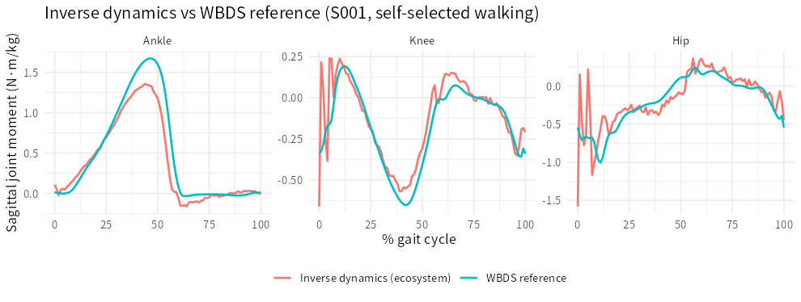

> **What this case shows** — motion capture records how the body *moves*
> (kinematics); the clinically decisive quantities are the joint *moments* that
> cause the motion (kinetics), and **inverse dynamics** is the bridge. Driving the
> ecosystem's 2-D Newton-Euler inverse dynamics with real WBDS **markers + ground
> reaction force**, and validating against the dataset's OWN independently-computed
> joint moments, the recovered sagittal moments agree strongly — and, revealingly,
> with a **distal-to-proximal accuracy gradient**: **ankle r = 0.97, knee r = 0.85,
> hip r = 0.77** (mean over 5 subjects). The ankle, nearest the measured GRF, is
> recovered almost exactly, including its ~1.5–1.7 N·m/kg push-off peak; the hip
> degrades and its peak inflates. **What reproduces, and what doesn't** — the
> *waveforms and the ankle magnitude* reproduce; the *hip magnitude* does not (the
> greater-trochanter hip-centre proxy inflates it). That gradient is the textbook
> behaviour of inverse dynamics, so the case reproduces a real methodological truth,
> not merely a number.

::: {.callout-tip title="The recipe you'll learn"}
**Workflow** — to turn measured motion into joint kinetics: **load** markers +
GRF → **assemble** the sagittal joint-centre chain (toe→ankle→knee→hip) →
**inverse dynamics** (`inverseDynamics2D`, Newton-Euler, de Leva inertia from body
mass + height) → **validate** the recovered moments against a reference.
**Way of thinking** — inverse dynamics integrates the external force (GRF) *up* the
limb, so error grows with distance from the plate: trust the **ankle** most, the
**hip** least, and *say so*. Express moments in **body-weight units** (N·m/kg) to
compare across subjects, and align the per-joint **sign convention** before you
compare.
**Ecosystem usage** — `inverseDynamics2D()` (or `inverseDynamicsRNE()` for the
recursive Newton-Euler form, `inverseDynamics3D()` for three planes), with
`estimateSegmentInertia()` supplying the anthropometry.
:::

## Proposition

On real WBDS walking, the ecosystem's inverse dynamics recovers the sagittal joint
moments from markers + GRF, validated against the dataset's own moments, with the
expected distal-to-proximal accuracy gradient: **ankle r = 0.97**, knee r = 0.85,
hip r = 0.77 (5 subjects), and a physiological ankle push-off peak (~1.66 N·m/kg
reference, ~1.42 recovered).

## Question & goal

**The question is the reason motion capture exists in a clinic.** Angles alone do
not tell you *why* a limb moves — whether a knee "extends" under an internal
extensor moment or collapses under an external one. Inverse dynamics answers that,
but it is an *inference* (from position, mass and force to internal moment), so the
honest question is not only "can we compute joint moments?" but "**how well, and
where can we trust them?**" WBDS is the ideal test bed: it ships both the raw
signals *and* its own computed moments, so we can validate the ecosystem's inverse
dynamics against an independent ground truth.

## Challenge & approach

Inverse dynamics needs a clean kinematic chain and a correctly-placed external
force. From the WBDS markers we build the right-limb sagittal chain — toe
(metatarsal-head midpoint), ankle, knee, hip (greater trochanter) — in the
progression/vertical plane; from the force plates we take the **right belt** (belt
2, confirmed empirically) vertical + fore-aft force and its centre of pressure,
resampled to the marker rate. `estimateSegmentInertia()` turns each subject's mass
and height into de Leva segment inertias, and `inverseDynamics2D()` runs the
Newton-Euler recursion foot→hip. We then time-normalise the recovered moments to
the gait cycle and compare, per joint, to the WBDS reference moment.

```
[markers + GRF]  →  sagittal joint chain (toe→ankle→knee→hip)  →
inverseDynamics2D(newton_euler, de-Leva inertia)  →  moments  →  vs WBDS knt
```

## Data

**WBDS** (Fukuchi et al. 2018) — 5 adults (WBDS01–05), self-selected-speed treadmill
walking. Inputs = marker trajectories + force plates; reference = the dataset's own
inverse-dynamics moments. Details in
[`artifacts/data_sources.json`](artifacts/data_sources.json); public on figshare
(<https://doi.org/10.6084/m9.figshare.5722711>).

## Results



*How to read this:* each panel is one joint's stance-phase moment in body-weight
units; the two lines are the ecosystem's inverse dynamics and the WBDS reference.
Overlap = agreement.

Agreement with the WBDS reference moments, mean over 5 subjects
([`artifacts/id_summary.csv`](artifacts/id_summary.csv); per-subject in
[`artifacts/id_agreement.csv`](artifacts/id_agreement.csv)):

| Joint | Correlation with reference | Recovered peak | Reference peak (N·m/kg) |
|---|---|---|---|
| Ankle | **0.97** | 1.42 | 1.66 |
| Knee | **0.85** | 0.77 | 0.60 |
| Hip | **0.77** | 1.46 | 0.93 |

The ankle sagittal moment — nearest the measured GRF — is recovered excellently in
every subject (all r > 0.90), magnitude included. Agreement falls monotonically up
the chain to the hip, whose peak *inflates*: the classic error propagation of
inverse dynamics, here compounded by the greater-trochanter marker standing in for
the true (medial) hip-joint centre.

## Conclusion

The ecosystem recovers walking joint kinetics from real kinematics + GRF and — the
point of the case — recovers them *with the accuracy structure real inverse
dynamics has*: excellent distally, degrading proximally. The transferable takeaway:
**inverse dynamics is trustworthy where it is anchored to the measured force (the
ankle) and increasingly uncertain away from it (the hip); a validated pipeline
reports that gradient rather than hiding it.**

## Open questions

- A **functional hip-joint-centre** (from the pelvis markers) in place of the
  greater-trochanter proxy, and a **full 3-D** inverse dynamics (frontal/transverse
  moments), would tighten the proximal agreement; an **OpenSim** residual-reduction
  / static-optimisation pass (`PhysioOpenSim`) would push on toward muscle-level
  kinetics. *Documented, not escalated.*

## Using this in your own analysis

This case is the pattern for **turning measured motion into joint kinetics** and
**validating the result** against a reference.

| Step | Function | Package |
|---|---|---|
| load markers + GRF (with events) | `readEDF()` / `readC3D()` | PhysioIO |
| segment inertia from mass + height | `estimateSegmentInertia()` | PhysioMoCap |
| sagittal inverse dynamics | `inverseDynamics2D()` (or `inverseDynamicsRNE()`) | PhysioMoCap |
| three-plane inverse dynamics | `inverseDynamics3D()` | PhysioMoCap |

**Choosing the parameters.**

- **Joint chain** — `inverseDynamics2D(model = "newton_euler")` needs the *toe* as
  well as ankle/knee/hip, because the foot's distal end fixes the foot centre of
  mass. Give sagittal-plane `*_x` (progression) and `*_y` (vertical) coordinates in
  metres.
- **The force plate must be the stance limb's** — pair the right-limb chain with the
  right-foot GRF (here belt 2) and its centre of pressure, or the ankle moment is
  physically wrong. When the dataset does not label the foot, confirm it
  empirically (the correct pairing gives the r≈0.97 ankle agreement).
- **Anthropometry** — `estimateSegmentInertia(body_mass, body_height, model)`
  (de Leva) scales the segment masses and radii of gyration; body-mass-normalise the
  moments (÷ mass) to compare across subjects.
- **Read the gradient** — expect and report higher accuracy distally; treat hip
  magnitudes cautiously unless you use a functional joint centre.

**The recipe, copy-runnable:**

```r
library(PhysioMoCap)

# markers -> sagittal joint-centre chain (X = progression, Y = vertical, metres)
J <- data.frame(
  ankle_x = mk$R.AnkleX/1000, ankle_y = mk$R.AnkleY/1000,
  knee_x  = mk$R.KneeX /1000, knee_y  = mk$R.KneeY /1000,
  hip_x   = mk$R.GTRX  /1000, hip_y   = mk$R.GTRY  /1000,
  toe_x   = (mk$R.MT1X + mk$R.MT5X)/2000,
  toe_y   = (mk$R.MT1Y + mk$R.MT5Y)/2000)

# right-foot GRF (fore-aft, vertical, COP), resampled to the marker rate
g <- data.frame(fx = grf$Fx2, fy = grf$Fy2, cop_x = grf$COPx2/1000)

id <- inverseDynamics2D(joints = J, grf = g, sampling_rate = 150,
                        body_mass = 74.3, body_height = 1.725,   # de Leva inertia
                        model = "newton_euler")

# body-mass-normalised sagittal moments, per joint (compare to the WBDS knt file)
ankle_moment <- id$ankle_moment / 74.3
cor(ankle_moment_cycle, wbds_RAnkleMomentZ)   # ~0.97 at the ankle
```

**Auditing the numbers.** Every value on this page traces to
[`artifacts/`](artifacts/) — the mean agreement in
[`id_summary.csv`](artifacts/id_summary.csv), every subject in
[`id_agreement.csv`](artifacts/id_agreement.csv), and the WBDS01 waveforms in
[`id_waveform_S001.csv`](artifacts/id_waveform_S001.csv) — and
[`audit.py`](audit.py) re-checks each reported number, the distal-to-proximal
accuracy gradient, and the honestly-reported hip inflation against those artifacts.
