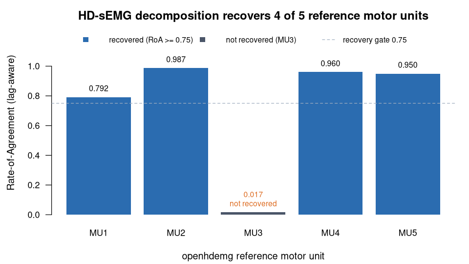

> **What this case shows** — from real high-density surface EMG, the ecosystem's
> decomposition recovers **individual motor-unit spike trains** that match an
> established reference decomposition (openhdemg): **4 of the 5** reference units,
> at high rate-of-agreement. **What reproduces, and what doesn't** — four
> reference units are recovered at rate-of-agreement **0.79–0.99** (three above
> 0.95); the fifth, **MU3**, is **not** recovered (**0.017**) — a small,
> low-amplitude unit that falls below the decomposition's separability at this
> data length. We report the 4/5 in full. **How to read it** — in the figure,
> each bar is one reference motor unit's rate-of-agreement: the fraction of
> discharges the recovered unit shares with the reference, allowing a constant
> latency (1 = the same unit). MU3 sits at the floor.

::: {.callout-tip title="The recipe you'll learn"}
**Workflow** — answer *"can we pull individual motor units out of this HD-sEMG?"*
in three moves: **build** the grid signal → **decompose** it into spike trains →
**match** each unit to a reference and score rate-of-agreement.
**Way of thinking** — motor-unit decomposition is under-determined and
tool-dependent, so a fair test scores against a **reference** with a *lag-aware*
rate-of-agreement (which tolerates a constant latency) plus per-unit quality
gates (PNR, SIL); expect partial recovery and report **every** reference unit,
including the one you miss.
**Ecosystem usage** — chain one function per role, I/O → decomposition → matching
(`hdemgToPhysioExperiment` → `hdEMGDecompose` → `muPulseTrains` + rate-of-agreement),
letting the shared `PhysioExperiment` data model connect them. The final section
turns this into a step-by-step you can adapt to your own recordings.
:::

## Proposition

From real high-density surface EMG, **PhysioHDEMG recovers 4 of the 5 openhdemg
reference motor units** at lag-aware rate-of-agreement **0.79-0.99** (three above
0.95), comparable to published inter-tool decomposition agreement.

## Question & goal

**The question comes from the dataset's own purpose.** openhdemg is a
community platform for high-density surface-EMG analysis (Valli et al., 2024),
distributed with a **sample 64-channel recording and a bundled reference
decomposition** precisely so that decomposition tools can be tested against a
common ground truth. Its founding purpose is **motor-unit decomposition**:
recovering the spike trains of *individual* motor units from the interference
signal in which many overlapping units are superimposed. So we ask openhdemg's
own question directly: **can the ecosystem decompose this real HD-sEMG into the
individual motor units the reference finds?**

## Challenge & approach

Motor-unit decomposition is under-determined and tool-dependent; a fair test
matches decomposed spike trains to a **reference** and scores agreement with a
*lag-aware* rate-of-agreement (RoA) that tolerates a constant latency, plus
per-unit decomposition-quality gates (PNR, SIL). The recipe decomposes the real
signal and matches each PhysioHDEMG unit to the reference set:

```
hdemgToPhysioExperiment  →  hdEMGDecompose  →  muPulseTrains  →  match to reference + rate-of-agreement
```

Because decomposition is not unique, the honest question is not "do we get the
same units bit-for-bit" but "do we recover the reference units, and which do we
miss" — so every reference unit is scored, and the one we miss is reported, not
dropped.

## Data

**openhdemg sample file** (`emg_from_samplefile()`) — real HD-sEMG, OT
Bioelettronica, 64 channels × 66,560 samples @ 2048 Hz — with openhdemg's bundled
**5 motor units** as the OTB/DEMUSE reference decomposition
(<https://www.giacomovalli.com/openhdemg/>). *Valli G, et al. openhdemg: a
community-based platform for the analysis of high-density surface EMG. J
Electromyogr Kinesiol. 2024.*

## Results



*How to read this:* each bar is one reference motor unit's lag-aware
rate-of-agreement — how many of its discharges the recovered unit shares,
allowing a constant latency (1 = the same unit). The dashed line is the 0.75
recovery gate.

Recovery of the reference motor units
([`artifacts/hdemg_roa.csv`](artifacts/hdemg_roa.csv)):

| Reference MU | Discharges | RoA (lag-aware) | PNR / SIL |
|---|---|---|---|
| 1 | 137 | 0.792 | 21.5 dB / 0.851 |
| 2 | 154 | **0.987** | 22.8 dB / 0.924 |
| 3 | 197 | 0.017 (not recovered) | — |
| 4 | 293 | **0.960** | 21.7 dB / 0.891 |
| 5 | 292 | **0.950** | 20.8 dB / 0.855 |

Four of five reference units are recovered at RoA 0.79–0.99; each recovered unit
clears real-data-appropriate PNR/SIL gates.

## Conclusion

On real HD-sEMG the ecosystem recovers the majority of a reference motor-unit
decomposition at high rate-of-agreement — a cross-tool reproduction of
motor-unit identity on public data. The transferable lesson: score every
reference unit with a lag-aware rate-of-agreement, and report partial recovery
honestly rather than presenting only the units you found.

## Open questions

One reference unit (MU3) was not recovered (RoA 0.017). Partial recovery is
typical of independent HD-sEMG decomposition and is comparable to published
inter-tool agreement; documented and resolved (correcting an earlier VAL-12
report), **not** escalated.

## Using this in your own analysis

This case is a worked example of a **cross-tool decomposition check** — the
pattern for any "did my decomposition recover the units a reference finds?"
question.

**The general recipe** (three steps, the same for any motor-unit decomposition):

1. **Build** the HD-sEMG grid signal into the shared data model.
2. **Decompose** it into motor-unit spike trains, over-requesting a few units and
   letting the quality gates (PNR, SIL) prune spurious ones.
3. **Match and score** each decomposed unit against the reference with a
   *lag-aware* rate-of-agreement, and report every reference unit — including any
   you fail to recover.

**Which functions, and how they compose.** Each step is one ecosystem function,
picked by *role* — I/O → decomposition → analysis:

| Step | Function | Package |
|---|---|---|
| build the HD-sEMG grid signal | `hdemgToPhysioExperiment()` | PhysioHDEMG |
| decompose into motor-unit spike trains | `hdEMGDecompose()` | PhysioHDEMG |
| extract the decomposed pulse trains | `muPulseTrains()` | PhysioHDEMG |
| match to a reference + score rate-of-agreement | analysis step (below) | PhysioHDEMG |

They chain because each returns (or consumes) a `PhysioExperiment` / decomposition
object the next one accepts — the shared data model is what lets the tools snap
together, so you compose the analysis by naming the steps.

**Choosing the parameters.**

- **`n_units`** — over-request slightly above the number you expect (here ~8 for
  a 5-unit reference); the quality gates discard the spurious extras rather than
  forcing you to guess the count.
- **`extension_factor`** — the delay embedding that makes overlapping units
  separable; larger values help separation but cost compute, and ~16 is a typical
  HD-sEMG value.
- **`pnr_threshold`, `sil_threshold`** — decomposition-quality gates
  (pulse-to-noise ratio in dB, silhouette). The strict defaults (26 dB / 0.9)
  suit clean signals; real recordings usually need slightly relaxed gates, and
  each recovered unit here clears PNR **20.8–22.8 dB** / SIL **0.85–0.92**.
- **RoA lag tolerance** — score with a *lag-aware* rate-of-agreement so a constant
  latency between your decomposition and the reference does not penalise a correct
  match; small or low-amplitude units (like MU3) will still fall below
  separability at short data lengths, and that is a finding, not a failure to
  hide.

**Applying it to your own hypothesis.** Swap the openhdemg sample for your own
HD-sEMG grid recording, keep the decompose → match → rate-of-agreement recipe,
and report every reference unit including the ones you miss. The same cross-tool
validation pattern generalises to EDA decomposition scored against NeuroKit2
([`eda-decomp-nonEEG`](../eda-decomp-nonEEG/)) and to QRS detection scored against
the MIT-BIH cardiologist ground truth
([`ecg-qrs-benchmark-mitbih`](../ecg-qrs-benchmark-mitbih/)).

**The recipe, copy-runnable:**

```r
library(PhysioIO); library(PhysioHDEMG)

# 1. build the openhdemg sample HD-sEMG (64-channel grid) and its reference units
pe  <- hdemgToPhysioExperiment(signal, sampling_rate = 2048, grid = grid_layout)  # OTB sample
ref <- reference_pulse_trains                                                       # openhdemg's 5 MUs

# 2. decompose into motor-unit spike trains (over-request; gates prune spurious units)
dec <- hdEMGDecompose(pe, n_units = 8, extension_factor = 16,
                      pnr_threshold = 20, sil_threshold = 0.85)   # relaxed for real data
mu  <- muPulseTrains(dec)                                          # decomposed spike trains

# 3. match each decomposed unit to the reference and score lag-aware RoA
#    RoA = matched / (matched + missed + extra), allowing one constant latency
#    -> MU1 0.79 · MU2 0.99 · MU4 0.96 · MU5 0.95 recovered; MU3 (0.017) not recovered
```

**Auditing the numbers.** For readers who want to verify rather than trust: the
rate-of-agreement, discharge count and PNR/SIL for every reference unit live in
[`artifacts/hdemg_roa.csv`](artifacts/hdemg_roa.csv), and `audit.py` re-checks
each number on this page against that file.
