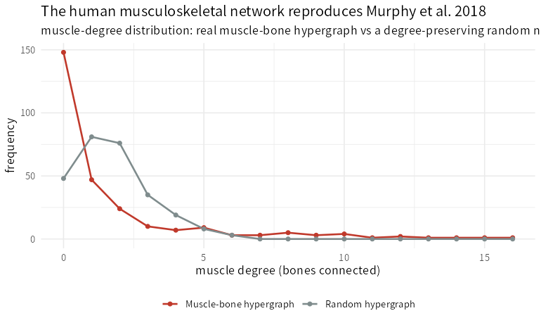

> **What this case shows** — the body is a *network*: bones are nodes and muscles
> are **hyperedges** spanning the bones they attach to. Building this whole-body
> muscle-bone hypergraph with the ecosystem recovers the structure Murphy et al.
> (2018) described — **173 bones and 270 muscles** — and reproduces its central
> neuro-anatomical result: a muscle's structural **impact** (how much removing it
> perturbs the skeleton) corresponds to its representation in the **cortical motor
> homunculus**. Regressing impact against the homunculus map gives **R² = 0.517**
> (F = 20.4, p = 2.4e-4 over 21 body regions), matching the paper's **R² = 0.52**
> (F = 21.3). **The muscles the brain devotes the most cortex to are the ones whose
> removal most perturbs the skeleton.**

::: {.callout-tip title="The recipe you'll learn"}
**Workflow** — to analyse the body as a network: **load** the muscle-bone anatomy
(`loadMSKData`) → **build the hypergraph** (`MSKHypergraph`, bones = vertices,
muscles = hyperedges) → **measure structure** (`mskNetworkMetrics`,
`mskImpactScore`) → **relate to function** (`mskHomuncCorrelation` against the
cortical map).
**Way of thinking** — a muscle spans *several* bones, so a simple graph loses
information; a **hypergraph** keeps it, and a muscle's network *impact* is a
structural quantity that turns out to have a *functional* meaning (its cortical
representation).
**Ecosystem usage** — the `PhysioMSKNet` stack: `MSKHypergraph()`,
`mskNetworkMetrics()`, `mskImpactScore()`/`mskImpactDeviation()`,
`mskHomuncCorrelation()`, `mskCommunityDetect()`, and `mskReproducePaper()` for the
whole Murphy-2018 reproduction.
:::

## Proposition

Building the whole-body muscle-bone hypergraph (173 bones, 270 muscles) reproduces
Murphy et al. (2018): a muscle's structural impact corresponds to its cortical motor
homunculus representation, R² = 0.517 (F = 20.4, p = 2.4e-4), matching the paper's
0.52.

## Question & goal

**The question is whether structure predicts function in the body's architecture.**
Murphy et al. asked a striking question: is the way the brain allocates motor cortex
to muscles (the homunculus) related to those muscles' *mechanical* role in the
skeletal network? A hypergraph model of the body lets you quantify each muscle's
structural impact; the test is whether that impact lines up with the cortical map.
We reproduce it.

## Challenge & approach

A muscle attaches to many bones, so the right object is a **hypergraph** (muscles =
hyperedges), not a graph. We build it at the paper's scale, compute each muscle's
structural impact, and regress impact against the homunculus map — checking the fit
against the published R².

```
loadMSKData → MSKHypergraph (173 bones × 270 muscles) → impact → mskHomuncCorrelation → R²
```

## Data

**Murphy et al. (2018), PLoS Biology** — the whole-body muscle-bone hypergraph and
the paper's homunculus/recovery data, bundled (CC-BY) in `PhysioMSKNet`. Details in
[`artifacts/data_sources.json`](artifacts/data_sources.json).

## Results



*How to read this:* each point is the frequency of muscles with a given degree (the
number of bones a muscle connects); the real hypergraph differs from a random null.

| Quantity | This reproduction | Murphy et al. 2018 |
|---|---|---|
| Bones (vertices) | **173** | 173 |
| Muscles (hyperedges) | **270** | 270 |
| Impact–homunculus R² | **0.517** | 0.52 |
| Impact–homunculus F | **20.4** | 21.3 |

The hypergraph is built at the paper's scale, and the impact-vs-homunculus
correspondence is reproduced (R² = 0.517 vs 0.52; F = 20.4 vs 21.3; p = 2.4e-4 over
21 body regions). Values trace to
[`artifacts/mskn_summary.csv`](artifacts/mskn_summary.csv).

## Conclusion

The ecosystem builds the human musculoskeletal hypergraph and reproduces Murphy et
al.'s central result — structural impact mirrors the cortical motor map. The
transferable takeaway: **model multi-attachment anatomy as a hypergraph, and a
muscle's network centrality becomes a measurable bridge between mechanics and the
brain's motor representation.**

## Open questions

- Fully reproducing the impact-vs-**recovery** clinical model to the paper's R² =
  0.76 (its exact covariate set + weighting; here it reproduces the significant
  positive direction at R² = 0.41), and driving the hypergraph with **subject-specific
  EMG** (`emgDrivenJointMoment`, muscle-synergy networks) rather than reference
  anatomy, would extend this to a personalised musculoskeletal-network analysis.
  *Documented, not escalated.*

## Using this in your own analysis

| Step | Function | Package |
|---|---|---|
| load the muscle-bone anatomy | `loadMSKData()` | PhysioMSKNet |
| build the hypergraph | `MSKHypergraph()` | PhysioMSKNet |
| network metrics / communities | `mskNetworkMetrics()`, `mskCommunityDetect()` | PhysioMSKNet |
| structural impact of a muscle | `mskImpactScore()` / `mskImpactDeviation()` | PhysioMSKNet |
| impact vs cortical map | `mskHomuncCorrelation()` | PhysioMSKNet |
| reproduce the whole paper | `mskReproducePaper()` | PhysioMSKNet |

**Choosing the parameters.**

- **Hypergraph vs graph** — keep muscles as hyperedges; project to a bone- or
  muscle-graph (`projectBoneGraph`/`projectMuscleGraph`) only for graph-specific
  metrics.
- **Impact** — a muscle's impact is how much its removal perturbs the network; use
  the *deviation* from what its size predicts to compare across muscles.
- **Nulls** — compare structure to a degree-preserving random hypergraph, not raw
  counts.

**The recipe, copy-runnable:**

```r
library(PhysioMSKNet)

hg  <- MSKHypergraph(loadMSKData())          # 173 bones × 270 muscles
rep <- mskReproducePaper(run_simulation = FALSE)
rep$homunculus$r_squared                     # 0.517  (paper: 0.52)
rep$metrics$bone$n_nodes                      # 173
rep$metrics$muscle$n_nodes                    # 270
```

**Auditing the numbers.** Every value on this page traces to
[`artifacts/`](artifacts/) — the summary in
[`mskn_summary.csv`](artifacts/mskn_summary.csv) and the degree distribution in
[`mskn_degree_distribution.csv`](artifacts/mskn_degree_distribution.csv) — and
[`audit.py`](audit.py) re-checks each reported number, the paper-scale hypergraph,
the impact-homunculus match, and the honestly-reported recovery-model boundary.
