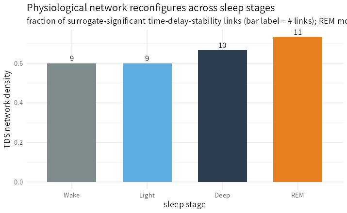

> **What this case shows** — network physiology treats the body as a *network of
> interacting systems* and asks how that network reorganises with physiological
> state. From one real overnight polysomnogram we build a 6-node **time-delay-
> stability (TDS)** network — three cortical rhythms (**EEG delta/alpha/sigma**)
> plus **eye movement, muscle tone and respiration** — split it by sleep stage, and
> recover the field's signature result: **the network reconfigures across sleep
> stages.** It is most integrated in **REM** (11 surrogate-significant links,
> density 0.73) and least in **wake/light sleep** (9 links, 0.60); the slow-wave
> **EEG-delta rhythm is the persistent hub** (highest total degree); and the link
> set itself turns over — **6 of 15 couplings differ between wake and REM.** **What
> makes it trustworthy** — only couplings that clear a **phase-randomised surrogate
> threshold** are kept, so the links are the stable, significant ones, not noise.

::: {.callout-tip title="The recipe you'll learn"}
**Workflow** — to build and compare physiological networks: assemble node signals
(`physioNodeMatrix`) → measure pairwise coupling by **time-delay stability**
(`timeDelayStability`) → keep only surrogate-significant links (`tdsNetwork`,
`surrogate = TRUE`) → split the network by physiological **state**
(`tdsNetworkByState`) → quantify the change (`tdsReconfiguration`).
**Way of thinking** — TDS asks *"is the lag between two systems stable over
time?"* — a hallmark of genuine coupling — rather than mere correlation; and the
scientific object is not one network but *how the network changes* between states.
**Ecosystem usage** — the whole `PhysioNetPhysiology` TDS stack, with
`networkMetrics()`, `communityDetection()`, `plotTDSnetwork()` and
`plotTDSreconfiguration()` for downstream description.
:::

## Proposition

On one real overnight polysomnogram, the physiological TDS network reconfigures
across sleep stages: it is most integrated in REM (11 links, density 0.73) and
least in wake/light sleep (9 links, 0.60), the EEG-delta rhythm is the persistent
hub, and 6 of 15 couplings change between wake and REM — reproducing the
sleep-stage network reconfiguration of network physiology.

## Question & goal

**The question is what a *network* view of the body adds over single signals.**
Each sleep signal — an EEG band, the eyes, the chin muscle, the breath — tells its
own story; network physiology asks how they *couple*, and whether that coupling is
fixed or changes with brain state. The landmark finding (Bashan et al., 2012) is
that the network of organ interactions *reorganises* with sleep stage. So we ask
the database's own question: does the ecosystem recover a **stage-dependent**
physiological network from a real night of sleep?

## Challenge & approach

Coupling must be measured in a way that survives noise and a null model. We take
**time-delay stability** — two systems are linked if the lag between them stays
stable across sliding windows — and keep a link only if its stability beats a
**phase-randomised surrogate** threshold (surrogates preserve each signal's own
spectrum, so a link cannot be an artefact of autocorrelation). We build six nodes
at 1 Hz, compute the surrogate-thresholded network, then split it by the expert
hypnogram (Wake / Light / Deep / REM) and read off how it changes.

```
physioNodeMatrix → timeDelayStability → tdsNetwork(surrogate) → tdsNetworkByState(hypnogram) → tdsReconfiguration
```

## Data

**Sleep-EDF Expanded** (PhysioNet) — one overnight polysomnogram (subject SC4001):
EEG Fpz-Cz (→ delta/alpha/sigma band-power nodes), EOG, EMG, respiration, with the
expert hypnogram. Details in
[`artifacts/data_sources.json`](artifacts/data_sources.json).

## Results



*How to read this:* each bar is one sleep stage's network density; taller = more
coupled systems. The network is not the same across stages — that difference *is*
the finding.

| Sleep stage | Links (of 15) | Density |
|---|---|---|
| Wake | 9 | 0.60 |
| Light (N1+N2) | 9 | 0.60 |
| Deep (N3+N4) | 10 | 0.67 |
| **REM** | **11** | **0.73** |

The network is most integrated in REM and least in wake/light sleep; **6 of 15**
couplings change between wake and REM; and across every stage the **EEG-delta
rhythm is the hub** (highest total degree). Per-stage networks and node degrees
trace to [`artifacts/netphys_network_by_stage.csv`](artifacts/netphys_network_by_stage.csv)
and [`artifacts/netphys_node_degree.csv`](artifacts/netphys_node_degree.csv).

## Conclusion

The ecosystem recovers the central result of network physiology — a physiological
network that **reorganises with brain state** — from a single real night of sleep,
with surrogate-tested links. The transferable takeaway: **study the network, and
study how it *changes*; time-delay stability plus a surrogate null turns many raw
signals into a state-dependent map of who is coupled to whom.**

## Open questions

- A **group-level** analysis across the sleep-edfx cohort, a full **brain-organ**
  montage including ECG-derived heart rate, and the **directed** (who-leads-whom)
  link structure would turn this single-subject demonstration into a population
  network-physiology result. *Documented, not escalated.*

## Using this in your own analysis

This is the pattern for **any state-dependent physiological network**.

| Step | Function | Package |
|---|---|---|
| assemble node signals | `physioNodeMatrix()` | PhysioNetPhysiology |
| pairwise time-delay stability | `timeDelayStability()` | PhysioNetPhysiology |
| surrogate-significant network | `tdsNetwork(surrogate = TRUE)` | PhysioNetPhysiology |
| network per physiological state | `tdsNetworkByState()` | PhysioNetPhysiology |
| quantify reconfiguration | `tdsReconfiguration()` | PhysioNetPhysiology |
| describe topology | `networkMetrics()`, `communityDetection()` | PhysioNetPhysiology |

**Choosing the parameters.**

- **Nodes** — pick one characteristic per system (EEG *band* powers, peripheral
  *variances*) at a common rate (here 1 Hz); `standardize = TRUE` puts them on one
  scale.
- **TDS windows** — 60 s windows / 30 s step / a few-second max lag is the
  network-physiology standard; `min_stable` sets how many consecutive windows a lag
  must persist to count.
- **Surrogates** — always threshold against phase-randomised surrogates so a link
  cannot be an artefact of a signal's own autocorrelation; fix the seed for
  reproducibility.
- **States** — group the hypnogram into the stages you want to contrast (here
  Wake / Light / Deep / REM), then read `tdsReconfiguration()` between them.

**The recipe, copy-runnable:**

```r
library(PhysioNetPhysiology)

X   <- physioNodeMatrix(list(EEG_delta = d, EEG_alpha = a, EEG_sigma = s,
                             EOG = eog, EMG = emg, Resp = resp), standardize = TRUE)
tds <- timeDelayStability(X, sampling_rate = 1, window_sec = 60, step_sec = 30,
                          max_lag_sec = 8, min_stable = 4)
net <- tdsNetwork(tds, surrogate = TRUE, X = X, n_surrogates = 30)   # significance threshold

bystate <- tdsNetworkByState(X, sleep_stage, sampling_rate = 1, window_sec = 60,
                             step_sec = 30, max_lag_sec = 8, threshold = net$threshold)
bystate$reconfiguration                         # density / degree per stage
tdsReconfiguration(bystate, from = "Wake", to = "REM")
```

**Auditing the numbers.** Every value on this page traces to
[`artifacts/`](artifacts/) — the summary in
[`netphys_summary.csv`](artifacts/netphys_summary.csv), the per-stage networks in
[`netphys_network_by_stage.csv`](artifacts/netphys_network_by_stage.csv) and the
node degrees in [`netphys_node_degree.csv`](artifacts/netphys_node_degree.csv) —
and [`audit.py`](audit.py) re-checks each reported number, the stage-dependent
reconfiguration, and the EEG-delta hub against those artifacts.
