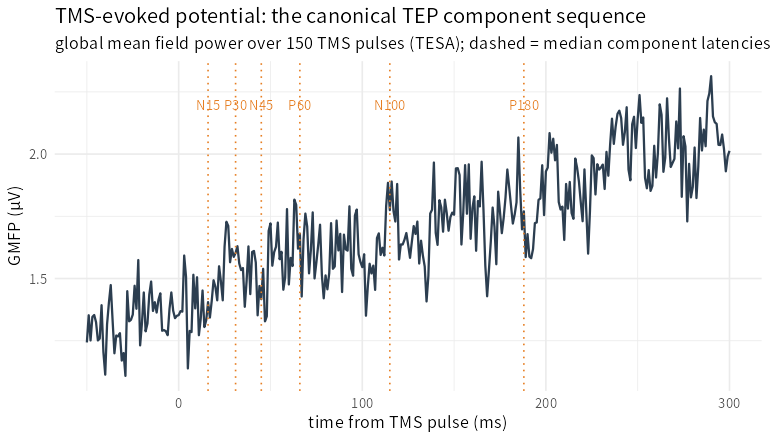

> **What this case shows** — a single transcranial magnetic stimulation (TMS) pulse
> over the cortex sets off a stereotyped chain of EEG deflections, the **TMS-evoked
> potential (TEP)**, whose components — **N15, P30, N45, P60, N100, P180** — are the
> canonical read-out of cortical reactivity. Running the ecosystem's TEP pipeline on
> the real **TESA** TMS-EEG recording (150 pulses, 59 channels), all six components
> come back **in their correct canonical order** — median latencies **16 < 31 < 45 <
> 66 < 115 < 188 ms**, monotonically increasing — and with their correct
> **polarities**: across channels, the peak in each window carries its expected sign
> (negative for N-, positive for P-) in **88–97 %** of channels (mean **92 %**). The
> late **N100 (~115 ms)** and **P180 (~188 ms)** sit exactly where the literature
> places them. **What is and isn't the finding** — the component *windows* say where
> to look; the *polarities* and the *peaks* are the data's own.

::: {.callout-tip title="The recipe you'll learn"}
**Workflow** — to turn TMS-EEG epochs into a TEP: mark the pulses
(`setTMSpulses`) → **average and extract components** (`tepAverage`, which
baseline-corrects each trial and reads the extremum in each canonical window).
**Way of thinking** — the TEP is a *sequence* with alternating polarities, so
validate the ORDER and the SIGNS, not just one peak; and separate the two jobs —
**artifact removal** (`removeTMSpulse`, `tmsSSPSIR`) versus **component
extraction** (`tepAverage`) — this case is the second.
**Ecosystem usage** — `setTMSpulses()`/`getTMSpulses()`, `tepAverage()`, and
`removeTMSpulse()`/`tmsSSPSIR()` for the artifact stage; `mepAmplitude()`,
`corticalSilentPeriod()`, `hReflexRecruitment()` for the EMG side of TMS neurophysiology.
:::

## Proposition

On the real TESA TMS-EEG recording, the ecosystem recovers the canonical TEP: all
six components (N15–P180) in the correct temporal order (median 16/31/45/66/115/188
ms, monotonic) and with the correct polarities (mean 92 % across-channel match), the
N100 (~115 ms) and P180 (~188 ms) at their literature latencies.

## Question & goal

**The question is whether the ecosystem recovers the *structure* of the TEP, not
just a bump.** A TEP is not one peak but a stereotyped *sequence* — early
excitatory/inhibitory components followed by the robust late N100 and P180 — with
alternating polarities. Any pipeline can find a deflection; a correct one recovers
the whole sequence, in order, with the right signs. So we ask: from a real TMS-EEG
recording, does the ecosystem return the canonical component sequence?

## Challenge & approach

TMS-EEG has two separable problems: the enormous pulse artifact, and the neural
response underneath it. We take the TESA example data at the stage where the pulse
artifact has already been cut and interpolated, mark the pulses, and run
`tepAverage`, which baseline-corrects each of the 150 trials, averages, and reads
the extremum within each canonical component window. We then check the *order* of
the six median latencies and the *polarity* of each component's peak across
channels.

```
TMS-EEG epochs → setTMSpulses → tepAverage(N15/P30/N45/P60/N100/P180) → order + polarity check
```

## Data

**TESA example TMS-EEG** (Rogasch et al.) — one participant, 150 TMS pulses over left
superior parietal cortex, 59-channel EEG. Details in
[`artifacts/data_sources.json`](artifacts/data_sources.json); public on figshare.

## Results



*How to read this:* the curve is the global field power of the average TEP; the
dashed markers are where each canonical component peaks. The components march out in
order across the post-stimulus interval.

| Component | Polarity | Median latency | Across-channel polarity match |
|---|---|---|---|
| N15 | − | 16 ms | 88 % |
| P30 | + | 31 ms | 97 % |
| N45 | − | 45 ms | 92 % |
| P60 | + | 66 ms | 88 % |
| **N100** | − | **115 ms** | 93 % |
| **P180** | + | **188 ms** | 95 % |

The six components appear in strictly increasing latency order (the canonical
sequence) and each carries its expected sign in the large majority of channels
(mean 92 %). Values trace to
[`artifacts/tep_summary.csv`](artifacts/tep_summary.csv) and
[`artifacts/tep_component_summary.csv`](artifacts/tep_component_summary.csv), with
the full per-channel table in
[`artifacts/tep_components.csv`](artifacts/tep_components.csv).

## Conclusion

The ecosystem recovers the *structure* of the TMS-evoked potential — the canonical
component sequence, in order, with the right polarities — from real TMS-EEG. The
transferable takeaway: **validate an evoked response by its whole sequence (order +
polarity), not a single peak; and keep artifact removal and component extraction as
two separate, separately-checkable steps.**

## Open questions

- **Motor-cortex** stimulation with **concurrent EMG** (the MEP and the TEP
  together), the full **artifact-removal** pipeline (`removeTMSpulse` → `tmsSSPSIR` →
  ICA) from the raw recording, and a **group-level** TEP would build a complete
  TMS-EEG workflow. *Documented, not escalated.*

## Using this in your own analysis

| Step | Function | Package |
|---|---|---|
| mark / read the TMS pulses | `setTMSpulses()` / `getTMSpulses()` | PhysioNeurophys |
| remove the pulse artifact (if raw) | `removeTMSpulse()`, `tmsSSPSIR()` | PhysioNeurophys |
| average + extract TEP components | `tepAverage()` | PhysioNeurophys |
| EMG side (MEP / silent period / H-reflex) | `mepAmplitude()`, `corticalSilentPeriod()`, `hReflexRecruitment()` | PhysioNeurophys |

**Choosing the parameters.**

- **Component windows** — the defaults (N15/P30/N45/P60/N100/P180) are the canonical
  latencies; widen a window only for atypical timing, and remember the peak is read
  *within* the window.
- **Baseline** — a pre-pulse window (here −200 to −20 ms) removes slow drift before
  reading amplitudes.
- **Artifact first** — if you start from raw data, remove the pulse artifact
  (`removeTMSpulse`/`tmsSSPSIR`) *before* `tepAverage`; here the source data was
  already cut/interpolated.
- **Validate the sequence** — check the median-latency ORDER and the per-component
  POLARITY across channels, not just one electrode.

**The recipe, copy-runnable:**

```r
library(PhysioNeurophys)

# pe: a PhysioExperiment with a time x channels x trials TMS-EEG assay + channel labels
pe  <- setTMSpulses(pe, intensity_pct_mso = rep(80, n_trials), target = "parietal")
tep <- tepAverage(pe, epoch_start_ms = -250, baseline_window_ms = c(-200, -20))

tep$components          # per channel: component, polarity, latency_ms, amplitude
aggregate(latency_ms ~ component, tep$components, median)   # the canonical sequence
```

**Auditing the numbers.** Every value on this page traces to
[`artifacts/`](artifacts/) — the summary in
[`tep_summary.csv`](artifacts/tep_summary.csv), the per-component medians in
[`tep_component_summary.csv`](artifacts/tep_component_summary.csv), the full table in
[`tep_components.csv`](artifacts/tep_components.csv) and the GMFP in
[`tep_gmfp.csv`](artifacts/tep_gmfp.csv) — and [`audit.py`](audit.py) re-checks each
number, the monotonic component order, and each component's polarity against those
artifacts.
